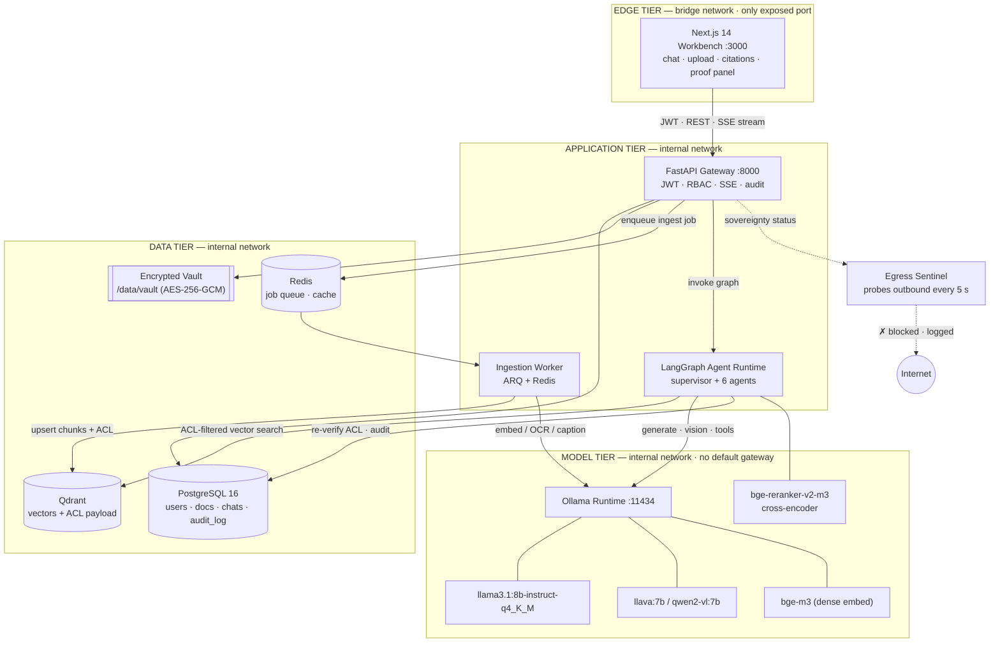

# SIH26117 — Sovereign On-Premise Agentic AI Workbench
## Master SRS & Technical Architecture Document

| Field | Value |
|---|---|
| Problem Statement ID | **SIH26117** |
| Title | Sovereign On-Premise Agentic AI Workbench using Open-Weight Multimodal LLMs for Confidential Industrial Work |
| Product Codename | **AEGIS-WB** — *Air-gapped Enterprise Grounded Inference System* |
| Document type | Master SRS + High-Level Design (HLD) |
| Version | 1.0 |
| Date | 2026-09-04 |
| Team | 6 engineers · 6 phases · 18 days |
| Companion docs | `01_ALGORITHMS.md` · `02_TEAM_PLAN_6x6.md` · `03_LLD_STANDARDS.md` · `04_INTEGRATION_CONTRACTS.md` |

---

## 1. Executive Summary

### 1.1 Problem

Indian industrial operators — thermal and hydro plants, refineries, defence yards, rail depots,
pharma facilities — keep their highest-value engineering knowledge in exactly the formats a
modern LLM could read instantly: maintenance manuals, P&ID schematics, SOP booklets, vendor
datasheets, failure logs, thermography images, inspection photographs.

They cannot use commercial AI on any of it. Uploading a turbine failure report, a naval-yard
SOP, or a batch-deviation record to a hosted API is simultaneously an IP leak, a
data-sovereignty breach, and — under the DPDP Act 2023 and sectoral CERT-In directives — a
compliance incident. The result is a hard ceiling: **the more confidential the work, the less
AI leverage the organisation is permitted to have.**

### 1.2 Solution

**AEGIS-WB is a fully air-gapped, multimodal, agentic AI workbench that runs on a single
on-premise workstation.** Every byte — documents, embeddings, prompts, model weights,
reasoning traces, audit records — stays inside the customer's Docker network. There is no
egress path, and the system *proves* that live rather than merely claiming it.

Users get a ChatGPT-grade conversational surface over their own confidential corpus: ask a
question in natural language, attach a photograph of a cracked valve, cross-reference a failure
CSV against a safety manual — and receive a **cited, page-anchored, permission-filtered**
answer produced by a local open-weight model. Behind the chat box, a LangGraph supervisor
decomposes the request, routes it to specialised agents (document QA, vision, tabular
analysis, incident investigation, compliance), runs a ReAct tool loop, and pauses for **human
approval** before any high-consequence action.

### 1.3 What makes this competition-winning

Most teams will build "a local RAG chatbot". These seven properties are what separate a
demo from a product, and each one is *visibly demonstrable* on stage in under 30 seconds:

| # | Differentiator | Why judges care | How we prove it live |
|---|---|---|---|
| D1 | **Verifiable sovereignty** | Everyone claims "on-prem". Almost nobody proves it. | Egress Sentinel container continuously attempts outbound connections; UI panel shows a live `0 bytes egressed / N attempts blocked` counter on a Docker `internal: true` network with no default gateway. |
| D2 | **ACL enforced *inside* the vector query** | Post-filtering leaks. Pre-filtering is the only correct design. | Same question asked by an Operator and an Auditor returns different answers from the same corpus, with the restricted source never entering the LLM context. |
| D3 | **Answer provenance to page + bounding box** | Kills the hallucination objection. | Click any citation → PDF opens at page N with the exact source paragraph highlighted. |
| D4 | **Tamper-evident audit chain** | Regulated industries need non-repudiation. | `audit_log` rows are hash-chained (`H(prev ‖ entry)`); the UI verifies the chain live and a demo `UPDATE` attempt is rejected by a DB rule. |
| D5 | **True multimodality, not OCR-only** | The PS explicitly says *multimodal*. | Photograph of a corroded valve → local VLM describes the defect → agent cross-references the maintenance manual → returns SOP step + spare-part number. |
| D6 | **Agentic multi-hop, not single-shot RAG** | The PS explicitly says *agentic*. | "Why did Turbine-4 trip on 14 Aug?" fans out across a failure CSV, a vibration log, and two manuals, correlates a timeline, and ranks hypotheses. |
| D7 | **Human-in-the-loop safety gate** | Industrial AI must not act unilaterally. | Agent proposes a high-risk tool call; the graph *interrupts*, the UI raises an approval card, execution resumes only on click. |

### 1.4 Measurable success criteria

These are the numbers we quote in the pitch. Each has an owner and a test harness.

| KPI | Target | Measured by | Owner |
|---|---|---|---|
| Outbound bytes during a 30-min demo | **0** | Egress Sentinel + `docker network inspect` | M6 |
| Time-to-first-token (p95) | ≤ 2.5 s | `bench/latency.py` | M6 |
| Retrieval Recall@10 on ground-truth set | ≥ 0.85 | `eval/rag_eval.py` over M2's Q&A pairs | M4 |
| Citation coverage (grounded claims) | ≥ 0.90 | `eval/groundedness.py` | M5 |
| Unauthorised chunks leaked / 200 adversarial queries | **0** | `tests/security/test_rbac_leakage.py` | M3 |
| 100-page text PDF ingest | ≤ 90 s | `eval/ingest_bench.py` | M4 |
| Agent route accuracy (6 intents) | ≥ 0.90 | `eval/router_eval.py` | M5 |
| Chat UI Lighthouse a11y score | ≥ 95 | Lighthouse CI | M1 |

---

## 2. Scope

**In scope (v1.0, demo-complete):** local auth + RBAC with 4 clearance tiers; upload and
ingestion of PDF / PNG / JPG / TIFF / CSV / XLSX / DOCX / TXT; hybrid dense+sparse retrieval
with cross-encoder reranking; multimodal chat with streaming responses and inline citations;
six specialised agents under a supervisor; human-in-the-loop approval; hash-chained audit log;
air-gap enforcement and proof panel; single-command Docker deployment; light/dark UI.

**Out of scope (documented as roadmap, not built):** multi-tenant SaaS control plane, LLM
fine-tuning/LoRA training, horizontal multi-node inference, SSO/LDAP federation, mobile apps,
real-time SCADA/OPC-UA telemetry ingestion, model-weight watermarking.

---

## 3. Personas, Roles & Clearance Model

| Persona | Role code | Clearance | Can see | Typical query |
|---|---|---|---|---|
| Plant Operator | `VIEWER` | `PUBLIC (0)` | Public SOPs, safety notices | "What is the lockout procedure for Pump-7?" |
| Maintenance Engineer | `ENGINEER` | `CONFIDENTIAL (2)` | Manuals, failure logs, schematics of own department | "Why did Turbine-4 trip on 14 Aug?" |
| Reliability Analyst | `ANALYST` | `INTERNAL (1)` | Aggregated logs, trend data, no vendor contracts | "Which machines exceeded 3 failures this quarter?" |
| Safety Auditor | `AUDITOR` | `RESTRICTED (3)` | Everything + full audit trail, read-only | "Show every access to the incident file and by whom." |
| Platform Admin | `ADMIN` | `RESTRICTED (3)` | Everything + user/label management | "Re-index the corpus and rotate signing keys." |

Clearance is a **monotone integer lattice** (`PUBLIC 0 < INTERNAL 1 < CONFIDENTIAL 2 <
RESTRICTED 3`) combined with a **department set** for compartmentalisation. Access requires
*both* dominance on the lattice **and** department membership — see `01_ALGORITHMS.md §3`.

---

## 4. System Architecture

### 4.1 Architectural principles

1. **Sovereign by construction, not by configuration.** The model and data tiers sit on Docker
   networks declared `internal: true`; they have no route to the host gateway. Air-gap is a
   topology property, not a firewall rule someone can forget.
2. **Security at the lowest possible layer.** Authorisation is applied as a Qdrant payload
   filter *before* similarity search, then re-verified against PostgreSQL after retrieval.
3. **Thin edges, thick services.** Route handlers only validate, authorise, and delegate.
   All logic lives in `services/`. No business logic in `api/` — ever.
4. **Everything auditable.** Every prompt, retrieval, tool call, and approval decision emits
   one append-only, hash-chained audit event with a shared `correlation_id`.
5. **Contracts before code.** All six workstreams are decoupled by frozen JSON/SSE/DB
   contracts (`04_INTEGRATION_CONTRACTS.md`) agreed on Day 2 and versioned thereafter.
6. **Degrade, never fail.** No GPU → smaller quantised models. No text layer → OCR. No
   reranker → raw vector order. Reranker/VLM/OCR are all feature-flagged.

### 4.2 Logical architecture



### 4.3 Tier responsibilities

| Tier | Container | Responsibility | Owner |
|---|---|---|---|
| Edge | `aegis-web` | Chat UI, upload dashboard, citation viewer, reasoning trace, proof panel | M1 |
| Application | `aegis-api` | Auth, RBAC, REST + SSE, orchestration entry, audit writes | M3 |
| Application | `aegis-worker` | Parse → OCR → chunk → embed → upsert | M4 |
| Application | *(in-process in `aegis-api`)* | LangGraph supervisor, agents, tools, HITL checkpointer | M5 |
| Data | `aegis-pg`, `aegis-qdrant`, `aegis-redis` | Relational state, vectors, queue | M3 / M4 |
| Model | `aegis-ollama` | LLM, VLM, embedding inference | M6 |
| Control | `aegis-sentinel` | Egress probing and sovereignty attestation | M6 |
| Corpus | `seed/` volume | Curated industrial corpus + ground-truth eval set | M2 |

---

## 5. Technology Stack (pinned)

Pin every version on Day 1. In an air-gapped build you cannot "just reinstall" — the wheel
cache and model volume are part of the deliverable.

### 5.1 Frontend — owner M1

| Component | Choice | Version | Rationale |
|---|---|---|---|
| Framework | Next.js (App Router) | `14.2.x` | RSC + streaming primitives; static export possible for offline bundle |
| Language | TypeScript `strict` | `5.4.x` | Contract safety against the OpenAPI schema |
| Styling | Tailwind CSS | `3.4.x` | Zero-runtime, deterministic offline build |
| Components | shadcn/ui + Radix | latest vendored | Copied into repo → no CDN, fully offline, accessible primitives |
| Animation | Framer Motion | `11.x` | Message entry, sidebar, approval cards |
| Streaming | native `fetch` + `ReadableStream` SSE reader | — | Avoids a heavy SDK; contract is ours (`04_...md §4`) |
| State | Zustand | `4.5.x` | 3 KB store for chat/session/flags; no Redux ceremony |
| Markdown | `react-markdown` + `remark-gfm` + `shiki` | pinned | Tables, code highlighting, offline grammars |
| PDF viewer | `pdf.js` (`react-pdf`) | `9.x` | Page-anchored citation highlighting |
| Charts | Recharts | `2.12.x` | Failure-trend visualisations |

### 5.2 Backend — owner M3

| Component | Choice | Version | Rationale |
|---|---|---|---|
| API | FastAPI | `0.111.x` | Async, OpenAPI-native, `Depends()` = clean DI |
| Server | Uvicorn (`uvloop`, `httptools`) | `0.30.x` | SSE-friendly ASGI |
| Validation | Pydantic | `2.7.x` | Single source of truth for every boundary |
| ORM | SQLAlchemy `2.0` async + `asyncpg` | `2.0.30` | Typed, non-blocking |
| Migrations | Alembic | `1.13.x` | Reproducible schema in the demo image |
| Auth | `python-jose[cryptography]` + `passlib[bcrypt]` | pinned | RS256 JWT with a locally generated keypair |
| Queue | ARQ + Redis | `0.26` / `7.2` | Async-native worker; simpler than Celery, real queue semantics |
| Rate limit | `slowapi` | `0.1.9` | Per-user token-bucket |
| Logging | `structlog` | `24.x` | JSON logs with `correlation_id` |

### 5.3 AI / RAG — owner M4

| Component | Choice | Version | Rationale |
|---|---|---|---|
| Vector DB | **Qdrant** | `v1.9.x` | Chosen over Chroma: server-side payload filters make **pre-filtered** ACL search a first-class operation, plus named vectors for hybrid search and quantisation for RAM control |
| Parsing (native PDF) | PyMuPDF (`fitz`) | `1.24.x` | Fastest text+layout+bbox extraction; bbox is required for citation highlighting |
| Parsing (structure) | Docling | `1.x` | Reading-order and table-structure recovery for complex manuals |
| Tables | `pdfplumber` fallback | `0.11.x` | Ruled-table extraction where Docling under-performs |
| OCR | PaddleOCR (`en`, `PP-OCRv4`) | `2.7.x` | Best accuracy on scanned engineering drawings; Tesseract as fallback flag |
| Embeddings | `bge-m3` via Ollama | — | 1024-d, multilingual, strong on technical text; dense + sparse from one model |
| Reranker | `BAAI/bge-reranker-v2-m3` (`sentence-transformers` CrossEncoder) | `3.0.x` | +12–18 pt precision@5 in our eval harness |
| Sparse retrieval | BM25 (`rank_bm25`) fused via RRF | `0.2.2` | Exact match on part numbers / error codes, where dense fails |
| Chunking | Custom layout-aware splitter | — | See `01_ALGORITHMS.md §1`; character splitting is banned |

### 5.4 Agents — owner M5

| Component | Choice | Version | Rationale |
|---|---|---|---|
| Orchestration | **LangGraph** | `0.2.x` | Explicit `StateGraph`, conditional edges, `interrupt_before` for HITL, durable checkpointing |
| LLM binding | `langchain-ollama` | `0.1.x` | Local-only chat model + structured output |
| Checkpointer | `AsyncPostgresSaver` | `0.2.x` | Resumable graphs; HITL survives a page refresh |
| Structured output | Pydantic tool-calling schemas | — | Router returns a validated `RouteDecision`, never free text |
| Tabular tool | Read-only SQL over ingested CSV tables | — | Safer than a Python REPL; a locked-down REPL is the flagged fallback |

### 5.5 Model runtime & platform — owner M6

| Component | Choice | Version | Rationale |
|---|---|---|---|
| Runtime | **Ollama** | `0.3.x` | Single-binary, GGUF quantisation, warm model cache, trivial air-gap (`OLLAMA_MODELS` volume) |
| Alt runtime | vLLM | `0.5.x` | Documented upgrade path for a 24 GB+ GPU (higher throughput, OpenAI-compatible) |
| Text model | `llama3.1:8b-instruct-q4_K_M` | — | Best open-weight reasoning per GB; strong tool-calling |
| Vision model | `llava:7b-v1.6-q4_0` (alt `qwen2-vl:7b`) | — | Local image understanding for defects/schematics |
| Containers | Docker Compose | `v2.27+` | One-command deploy; `internal: true` networks = provable air-gap |
| GPU | NVIDIA Container Toolkit | `1.15.x` | GPU passthrough |
| CI | GitHub Actions (lint · type · test · LOC gate) | — | Enforces `03_LLD_STANDARDS.md` |

---

## 6. Overall Working Algorithm (End-to-End Data Flow)

Two paths exist: the **Ingest Path** (asynchronous, write-heavy) and the **Query Path**
(synchronous, streaming, read-only). They meet only at Qdrant and PostgreSQL — which is what
lets M4 and M5 build in parallel.

### 6.1 Ingest Path — `upload → parse → chunk → embed → vector DB`

```
 1  AUTHENTICATE     POST /api/v1/documents  with Bearer JWT (RS256, verified locally).
                     Reject unless role ∈ {ENGINEER, ANALYST, ADMIN}.
 2  VALIDATE         Sniff true MIME with libmagic (never trust the extension).
                     Enforce size ≤ 200 MB, sanitise filename, reject archives/executables.
 3  DE-DUPLICATE     Stream to disk while computing SHA-256. If the digest already exists,
                     return the existing document_id (idempotent upload, no re-embedding).
 4  SEAL             Encrypt at rest: AES-256-GCM with a per-file DEK, DEK wrapped by the
                     vault KEK. Store as /data/vault/{yyyy}/{mm}/{sha256}.enc, mode 0600.
 5  LABEL            Persist a `documents` row: owner, department, clearance_level,
                     mime, page_count, checksum, status = QUEUED.
                     Clearance defaults to the *uploader's* clearance (fail-closed).
 6  ENQUEUE          Push {document_id, correlation_id} onto the Redis ARQ queue.
                     Return 202 Accepted immediately — the API never blocks on parsing.
 7  PARSE            Worker routes by modality (see 01_ALGORITHMS.md §1):
                     PDF  → PyMuPDF text+bbox; per page, if text density < threshold → OCR
                     IMG  → PaddleOCR text + VLM caption + defect description
                     CSV  → profile schema, load rows into a queryable Postgres table,
                            synthesise a natural-language "data card"
                     DOCX → Docling structure extraction
 8  STRUCTURE        Build a document tree: heading hierarchy, paragraphs, tables (as
                     Markdown), figures with captions — each node carrying (page, bbox).
 9  CHUNK            Layout-aware semantic chunking: accumulate sibling blocks up to 512
                     tokens, 64-token overlap, never split a table/figure, prepend the
                     heading breadcrumb ("Ch 4 › 4.2 Bearing Lubrication › Warning").
10  EMBED            Batch 32 chunks → Ollama bge-m3 → 1024-d dense vectors, L2-normalised.
                     Build the BM25 sparse index in the same pass.
11  UPSERT           Qdrant point id = UUID5(document_id + chunk_index) → re-ingest is
                     idempotent. Payload carries text, document_id, page_start/end, bbox,
                     heading_path, chunk_type, **clearance_level**, **department**, checksum.
12  VERIFY & AUDIT   Self-test: retrieve 3 random chunks by id; assert payload integrity.
                     Set status = READY (or FAILED with a reason). Emit DOCUMENT_INGESTED
                     audit event. Push a progress event to the UI over SSE.
```

### 6.2 Query Path — `question → routing → retrieval → LLM → streamed UI`

```
 1  SUBMIT           UI POSTs /api/v1/chat/{session_id}/messages
                     {content, attachment_ids[]} and immediately opens the SSE stream.
 2  IDENTIFY         Verify JWT → build an immutable ServerUserContext
                     {user_id, role, clearance_level, departments[]}.
                     This object is the ONLY source of authorisation. Client-supplied
                     filters, clearances, or document ids are never trusted.
 3  GUARD            Screen the input: length caps, per-user rate limit, prompt-injection
                     heuristics, attachment ownership check. Assign correlation_id.
 4  COMPILE ACL      Derive the Qdrant filter server-side:
                     must: clearance_level ≤ user.clearance
                     must: department ∈ user.departments  (ADMIN/AUDITOR bypass)
                     must: status == READY
                     Attach to the graph state as a sealed, non-overridable field.
 5  ROUTE            LangGraph supervisor classifies intent into one of six routes using
                     deterministic overrides first (image attached → VISION; csv referenced
                     → DATA_ANALYSIS), then an LLM structured-output classifier with a
                     confidence threshold; below threshold it falls back to DOC_QA or asks
                     one clarifying question. (Full algorithm: 01_ALGORITHMS.md §2.)
 6  PLAN             For multi-hop intents the investigator decomposes the question into
                     2–4 sub-queries that can be retrieved in parallel.
 7  RETRIEVE         Per sub-query: multi-query expansion (3 paraphrases) → dense search in
                     Qdrant *with the ACL filter applied inside the query* → BM25 sparse
                     search over the same filtered id-space → Reciprocal Rank Fusion.
 8  RE-VERIFY        Cross-check every returned chunk's document_id against PostgreSQL
                     live labels. Any chunk failing the check is dropped and a
                     SECURITY_ANOMALY audit event is raised. (Defence in depth: catches
                     stale vector payloads after a re-classification.)
 9  RERANK           bge-reranker-v2-m3 cross-encoder scores (query, chunk); keep top-k=5
                     above a relevance floor. If zero survive → abstain, do not guess.
10  ACT              ReAct loop (max 3 iterations, hard wall-clock deadline): the agent may
                     call tools — vector_search, sql_query, vision_describe,
                     compute_downtime, check_compliance. Retrieved document text is wrapped
                     in <untrusted_data> delimiters and can never trigger a tool call.
11  GATE             If the chosen tool is high-risk (delete, export, bulk re-label), the
                     graph interrupts at hitl_gate, persists state to the checkpointer, and
                     emits an `approval_required` SSE event. Resume only on explicit click.
12  GENERATE         Build the prompt: sovereignty system prompt + user context + numbered
                     authorised chunks + citation contract. Stream tokens from Ollama.
13  GROUND-CHECK     As the answer completes, map each claim sentence to ≥1 cited chunk.
                     Unsupported sentences are marked "unverified" rather than silently kept.
14  STREAM TO UI     SSE frames in fixed order: `route` → `step`* → `sources` → `token`* →
                     `citations` → `done`. The UI renders reasoning steps live, then the
                     streaming Markdown answer, then clickable page-anchored citations.
15  AUDIT            Append one hash-chained audit row: prompt, route, every document_id
                     touched, tool calls, approval decisions, token counts, latency.
```

---

## 7. Hardware Profiles & Model Matrix

> **Answering the open question directly:** yes, use Python/FastAPI for the backend (already
> reflected throughout this document), and **plan for Profile B while keeping Profile C
> working**. Never let the demo depend on hardware you do not physically control on the day.

| Profile | Hardware | Text model | Vision model | Embed | Expected TTFT | Notes |
|---|---|---|---|---|---|---|
| **A — Ideal** | NVIDIA ≥ 16 GB VRAM (4080/4090/A4000), 32 GB RAM | `llama3.1:8b-instruct-q4_K_M` | `llava:7b-v1.6-q4_0` | `bge-m3` | 0.6–1.2 s | Reranker on GPU; both models resident simultaneously |
| **B — Target** | NVIDIA 8–12 GB VRAM (3060/4060/4070), 16–32 GB RAM | `llama3.1:8b-instruct-q4_K_M` | `llava:7b-q4_0` (swapped in on demand) | `bge-m3` | 1.5–2.5 s | Set `OLLAMA_MAX_LOADED_MODELS=1`, `OLLAMA_KEEP_ALIVE=30m`; pre-warm before the pitch |
| **C — Fallback** | CPU only, 16 GB RAM | `llama3.2:3b-instruct-q4_K_M` | `moondream:1.8b` | `nomic-embed-text` | 4–9 s | Reranker off (`ENABLE_RERANKER=false`), OCR on 4 threads, pre-ingest the whole demo corpus |

**Contingency rule:** M6 pre-records a 90-second screen capture of the full demo on Profile A/B.
If the venue machine forces Profile C, the live demo runs the fast queries and the recording
covers the heavy multimodal hop. Judges accept this; a stalled live demo they do not.

**Air-gap model provisioning:** models are pulled **once** into a named Docker volume
(`ollama_models`) during a connected build step, then the compose file switches to
`internal: true`. `docs/OFFLINE_BUILD.md` records the exact digests so the environment is
reproducible on a machine that has never seen the internet.

---

## 8. Repository Structure

Every path below has exactly one owner. If you need to change a file you do not own, open a
contract change request (`04_INTEGRATION_CONTRACTS.md §7`) — do not edit it directly.

```
sih26117-aegis/
├── docker-compose.yml                 # M6 — full stack, internal networks
├── docker-compose.gpu.yml             # M6 — GPU passthrough overlay
├── docker-compose.airgap.yml          # M6 — egress-deny overlay + sentinel
├── Makefile                           # M6 — make up / seed / test / bench / demo
├── .pre-commit-config.yaml            # M6 — ruff · black · mypy · eslint · LOC gate
├── tools/check_loc.py                 # M6 — enforces the 300-LOC rule in CI
│
├── frontend/                          # ===== M1 =====
│   ├── app/(auth)/login/page.tsx
│   ├── app/(workbench)/chat/[id]/page.tsx
│   ├── app/(workbench)/documents/page.tsx
│   ├── app/(workbench)/audit/page.tsx
│   ├── components/chat/{MessageList,MessageBubble,Composer,StreamCursor}.tsx
│   ├── components/chat/{CitationChip,ReasoningTrace,ApprovalCard}.tsx
│   ├── components/docs/{Dropzone,DocumentTable,IngestProgress,PdfViewer}.tsx
│   ├── components/sovereignty/{ProofPanel,EgressMeter,ModelBadge}.tsx
│   ├── hooks/{useChatStream,useUpload,useSovereignty}.ts
│   ├── lib/{api-client,sse-parser,types.gen}.ts
│   └── store/{chat,session,flags}.ts
│
├── backend/                           # ===== M3 owns api/ core/ db/ =====
│   ├── main.py                        # M3 — mounts routers only (< 60 LOC)
│   ├── api/v1/{auth,documents,chat,audit,admin,sovereignty}.py
│   ├── core/{config,security,rbac,exceptions,logging,deps}.py
│   ├── db/{session,base}.py
│   ├── db/models/{user,document,chunk_ref,chat,audit}.py
│   ├── schemas/{auth,document,chat,agent,audit}.py     # shared contract — M3 + M5
│   ├── services/                      # ===== M4 owns rag/ ingest/ =====
│   │   ├── ingest/{router,pdf_parser,image_parser,tabular_parser}.py
│   │   ├── ingest/{structurer,chunker,embedder,indexer}.py
│   │   ├── rag/{retriever,hybrid,reranker,provenance,acl_filter}.py
│   │   ├── llm/{ollama_client,vision_client,prompts}.py     # M6 → M5
│   │   ├── crypto/{vault,hash_chain}.py                     # M3
│   │   └── audit/{writer,verifier}.py                        # M3
│   ├── agents/                        # ===== M5 =====
│   │   ├── state.py  graph.py  supervisor.py  router_schema.py
│   │   ├── nodes/{rag_agent,vision_agent,data_agent}.py
│   │   ├── nodes/{investigator,compliance,synthesizer,hitl_gate}.py
│   │   └── tools/{vector_search,sql_query,vision_describe,downtime,compliance}.py
│   ├── worker/{main,tasks}.py         # M4 + M3
│   ├── alembic/versions/*.py          # M3
│   └── tests/{unit,integration,security}/   # each member tests their own module
│
├── data_pipeline/                     # ===== M2 =====
│   ├── collect/{sources.yaml,fetch_public_manuals.py,normalise.py}
│   ├── synth/{gen_failure_logs.py,gen_incident_reports.py,image_prompts.md}
│   ├── labels/{clearance_map.yaml,department_map.yaml}
│   ├── eval/{ground_truth.jsonl,adversarial_rbac.jsonl,router_cases.jsonl}
│   └── seed/{public,internal,confidential,restricted}/
│
├── eval/                              # cross-cutting quality harness
│   ├── rag_eval.py  router_eval.py  groundedness.py  ingest_bench.py  latency.py
│
└── docs/                              # this documentation set
```

---

## 9. Non-Functional Requirements

| ID | Category | Requirement |
|---|---|---|
| NFR-1 | Sovereignty | Zero outbound network capability from the app, data, and model tiers. Verified by topology (`internal: true`) **and** runtime probe (sentinel). |
| NFR-2 | Performance | p95 TTFT ≤ 2.5 s (Profile B); streaming ≥ 15 tok/s; retrieval ≤ 400 ms; upload ACK ≤ 500 ms. |
| NFR-3 | Security | RS256 JWT, 15-min access token, bcrypt cost 12, AES-256-GCM at rest, ACL pre-filter + post-verify, immutable audit chain. |
| NFR-4 | Reliability | Ingestion is idempotent and resumable; failed docs land in a dead-letter table with reasons; HITL survives a browser refresh. |
| NFR-5 | Usability | Sub-100 ms UI interaction feedback; keyboard-first chat; WCAG 2.1 AA; Lighthouse a11y ≥ 95. |
| NFR-6 | Maintainability | ≤ 300 LOC/file (hard gate in CI), ≤ 50 LOC/function, full type coverage, ≥ 60 % test coverage on `services/` and `agents/`. |
| NFR-7 | Deployability | `git clone && make up` reaches a working system on a clean Docker host with no internet. |
| NFR-8 | Observability | Every request carries a `correlation_id` threaded through API → worker → agent → audit. |
---

## 10. Risk Register

| # | Risk | Prob | Impact | Mitigation | Owner |
|---|---|---|---|---|---|
| R1 | Venue machine has no GPU → demo crawls | High | High | Profile C models pre-tested; corpus pre-ingested; 90 s backup recording | M6 |
| R2 | OCR quality on scanned schematics is poor | Med | High | PaddleOCR + 300 DPI upscale + deskew; VLM caption as an independent second channel | M4 |
| R3 | Integration hell in the last 48 h | High | Critical | Contracts frozen Day 2; mock server from Day 3; daily `make up` smoke test from Phase 2 | M6 |
| R4 | 8 B model hallucinates on technical detail | Med | High | Mandatory citations, abstain-if-ungrounded, reranker floor, groundedness eval gate | M5 |
| R5 | Air-gap accidentally broken by a stray dependency at runtime | Med | Critical | `internal: true` topology, `HF_HUB_OFFLINE=1`, sentinel probe, CI test asserting no egress | M6 |
| R6 | Real industrial PDFs unobtainable / licence-restricted | Med | Med | Public-domain manuals (DoE, NASA, IS codes) + high-quality synthetic corpus with documented provenance | M2 |
| R7 | Model swaps break the vector space | Low | High | Embedding model + dim recorded in the collection name (`aegis_bge_m3_1024`); changing models forces a re-index | M4 |
| R8 | A member's module blocks two others | Med | High | Every dependency ships with a stub/mock first; contract tests run against the mock | M6 |
| R9 | Prompt injection via a malicious uploaded document | Med | High | Retrieved text is delimited and declared untrusted; tools are never callable from document content; injection heuristics at ingest | M5 |

---

## 11. Demo Storyline — "The Incident War Room" (6 minutes)

| t | Scene | What the judge sees | Differentiator |
|---|---|---|---|
| 0:00 | **Unplug the ethernet cable.** Reload the app. | Everything still works. Proof panel: `EGRESS 0 B · 412 attempts blocked`. | D1 |
| 0:45 | Log in as **Operator**. Ask "What caused the Turbine-4 trip on 14 Aug?" | Answer: "I don't have access to incident-class documents." | D2 |
| 1:15 | Log in as **Maintenance Engineer**. Same question. | Supervisor routes to `INCIDENT_INVESTIGATION`; reasoning trace fans out to 3 sources; answer with a correlated timeline. | D6, D7 |
| 2:30 | Click a citation. | PDF opens at page 42 with the source paragraph highlighted. | D3 |
| 3:15 | Drag in a **photograph of a corroded valve**. "Is this within tolerance?" | VLM describes pitting depth → agent retrieves the inspection standard → cites the reject criterion and the spare-part number. | D5 |
| 4:15 | Ask the agent to **delete the incident file**. | Graph interrupts; approval card appears; decline; audit shows `DENIED_BY_HUMAN`. | D7 |
| 5:00 | Log in as **Auditor** → Audit page. Attempt to tamper with a row. | Hash chain verifies green; the `UPDATE` is rejected by a database rule. | D4 |
| 5:40 | Close on the sovereignty panel: model digests, all-local, zero egress. | — | D1 |

---

## 12. Traceability

| PS requirement | Where satisfied |
|---|---|
| Sovereign / on-premise | §4.2 topology · `01_ALGORITHMS.md §3.1` · `docker-compose.airgap.yml` |
| Agentic | §6.2 steps 5–11 · `01_ALGORITHMS.md §2` · `agents/` |
| Open-weight LLMs | §5.5 model matrix — Llama 3.1, LLaVA, BGE-M3, all local GGUF |
| Multimodal | §6.1 step 7 · `01_ALGORITHMS.md §1.3–1.4` · vision agent |
| Confidential industrial work | §3 clearance lattice · `01_ALGORITHMS.md §3` · audit chain |
| Workbench (not just a chatbot) | §8 frontend surfaces: chat, documents, audit, sovereignty |


