# SIH26117 — Team Execution Plan
### 6 Members × 6 Phases · Balanced Workload Matrix · v1.0

---

## 1. Phase Calendar

| Phase | Days | Theme | Exit gate (demo-able at the end of the phase) |
|---|---|---|---|
| **P1** | 1–3 | Foundation & Frozen Contracts | Log in, upload a PDF, see it listed, get a hard-coded streamed reply from Llama 3.1 |
| **P2** | 4–6 | The RAG Spine | Ask a question about an uploaded PDF, get a real cited answer end to end |
| **P3** | 7–9 | Multimodal | Attach a photo of a defective part, get a grounded answer combining the image and a manual |
| **P4** | 10–12 | Agentic Intelligence | "Why did Turbine-4 trip?" runs multi-hop with a visible reasoning trace |
| **P5** | 13–15 | Security, Sovereignty & Governance | Two personas get different answers; audit chain verifies; ethernet cable unplugged, app still works |
| **P6** | 16–18 | Integration, Performance & Pitch | `make up` on a clean machine → full 6-minute demo runs twice without a hitch |

> **The rule that makes this work: nothing is "done" until it runs inside `docker compose up`.**
> Code that only works on a laptop does not count toward a phase gate.

---

## 2. Workload Balance Proof

Effort is normalised in **points** (1 pt ≈ half a focused working day). The matrix is
**doubly balanced**: every row sums to 30 and every column sums to 30.

| | P1 | P2 | P3 | P4 | P5 | P6 | **Total** |
|---|:--:|:--:|:--:|:--:|:--:|:--:|:--:|
| **M1** Frontend / UI | 5 | 5 | 5 | 6 | 4 | 5 | **30** |
| **M2** Data Engineer | 6 | 4 | 6 | 4 | 6 | 4 | **30** |
| **M3** Backend & Security | 6 | 6 | 4 | 4 | 6 | 4 | **30** |
| **M4** AI & RAG | 4 | 7 | 6 | 5 | 4 | 4 | **30** |
| **M5** Agentic Workflow | 3 | 4 | 5 | 8 | 6 | 4 | **30** |
| **M6** Lead / Integration | 6 | 4 | 4 | 3 | 4 | 9 | **30** |
| **Phase total** | **30** | **30** | **30** | **30** | **30** | **30** | **180** |

**How the light phases stay honest.** A member's lightest phase is their **float phase**: they
own cross-team support, code review, and the phase's integration smoke test. M5's P1 float is
writing the agent mock server that unblocks M1 and M3; M6's P4 float is performance profiling
while M5 builds. Nobody idles, and nobody is the bottleneck for three phases running.

---

## 3. Member 1 — Frontend / UI Engineer

**Primary focus.** Build the surface the judges actually look at: a ChatGPT-grade streaming chat
workbench that makes retrieval, agent reasoning, provenance, and sovereignty *visible*. You own
everything in `frontend/`. You are the only person who touches it.

**Owned paths.** `frontend/**` · `lib/types.gen.ts` (generated from M3's OpenAPI, never hand-edited)

| Phase | Deliverables | Definition of Done |
|---|---|---|
| **P1** (5) | Next.js 14 App Router + TS strict + Tailwind + shadcn/ui vendored offline. App shell: collapsible history sidebar, message list, auto-resizing composer (Enter sends, Shift+Enter newlines), light/dark tokens. Login page + JWT storage + auth-guarded route group. Typed API client generated from M3's OpenAPI. | `npm run build` passes with zero `any`; login → chat shell reachable; UI renders correctly with the mock server, no backend needed |
| **P2** (5) | Documents dashboard: drag-and-drop zone, per-file progress, MIME icons, status pills (`QUEUED/PARSING/READY/FAILED`), retry action. Real streaming: SSE reader consuming `token` frames with a blinking cursor; Markdown + GFM tables + Shiki code highlighting; sticky-bottom autoscroll that yields when the user scrolls up. | Upload a 40 MB PDF with a live progress bar; a 600-token answer streams without layout jank at 60 fps |
| **P3** (5) | Multimodal composer: image paste/drop, thumbnail strip, remove-before-send, client-side type/size validation. `CitationChip` component + `PdfViewer` (react-pdf) that opens the cited page and highlights the `bbox`. Image lightbox for source figures. | Click `[3]` → PDF opens at page 42 with the paragraph highlighted; attaching a 5 MB JPEG works end to end |
| **P4** (6) | `ReasoningTrace`: collapsible live timeline rendering `step` frames (reason → act → observe) with per-step timing, plus a route badge showing the chosen agent and confidence. `ApprovalCard`: renders `approval_required`, shows the tool name and arguments, Approve/Deny buttons wired to the resume endpoint. `SourcesRail` showing retrieved chunks with scores. Recharts failure-trend panel for `DATA_ANALYSIS` answers. | Reasoning steps appear in real time during a 20 s investigator run; denying an approval visibly ends the turn |
| **P5** (4) | `ProofPanel`: live `EgressMeter` (bytes egressed, attempts blocked), model digest badges, network-mode indicator, red banner on `SOVEREIGNTY_BREACH`. Audit page: filterable table, chain-verify button with a green/red result. Role-aware UI (hide admin actions, render `ACCESS_DENIED` gracefully, never expose a restricted title). | Auditor sees the audit page; Viewer cannot see it at all; proof panel updates every 5 s |
| **P6** (5) | Framer Motion polish (message entry, sidebar, approval card), skeleton loaders, empty/error/offline states, keyboard shortcuts (`⌘K` new chat, `⌘/` focus composer, `Esc` cancel stream), stop-generation button, copy-message, a11y pass to Lighthouse ≥ 95, responsive down to 1280×720 (projector safety). | Lighthouse a11y ≥ 95; full keyboard-only walkthrough of the demo script; zero console errors |

**Technical challenges to solve.**
1. **SSE with auth.** `EventSource` cannot send an `Authorization` header. Use `fetch` +
   `ReadableStream` + `TextDecoder` and hand-parse frames — write `lib/sse-parser.ts` as a pure,
   unit-tested function that correctly handles partial frames split across network chunks.
2. **Streaming Markdown re-parse cost.** Re-parsing the whole message every token is O(n²) and
   will visibly stutter past ~400 tokens. Buffer tokens and flush on a 60 ms `requestAnimationFrame`
   tick, memoise completed blocks, and only re-render the tail.
3. **Interleaving frame types.** `step`, `sources`, `token`, `citations`, and `approval_required`
   arrive on one stream. Model the message as a discriminated union in Zustand so a late `step`
   never overwrites already-streamed text.
4. **bbox → screen mapping.** PDF coordinates are bottom-left origin in points; the canvas is
   top-left in CSS pixels. Convert with the page viewport scale, and handle rotated pages.
5. **Fully offline fonts and assets.** No Google Fonts, no CDN, no remote icon sprite — vendor
   everything or the air-gapped build silently renders in a fallback font on stage.
6. **Autoscroll that isn't annoying.** Detect "user scrolled up" and stop pinning; show a
   "jump to latest" affordance instead.

---

## 4. Member 2 — Data Engineer / Corpus Owner

**Primary focus.** The corpus *is* the product's intelligence. You own everything the system
knows, plus the ground truth that lets us claim numbers instead of vibes. You are also the
team's quality gate: your eval sets are what turn "it seems to work" into "recall@10 = 0.87".

**Owned paths.** `data_pipeline/**` · `data_pipeline/seed/**` · `data_pipeline/eval/**`

| Phase | Deliverables | Definition of Done |
|---|---|---|
| **P1** (6) | `sources.yaml` provenance register (URL, licence, date, SHA-256 — licence hygiene matters when judges ask). Collect **50+** genuinely messy industrial documents: pump/turbine/compressor O&M manuals, lockout-tagout SOPs, IS/ISO safety codes, vendor datasheets, inspection checklists. Deliberately include ~15 **scanned** PDFs so OCR is exercised from day one. Normaliser script: dedupe by hash, strip nothing, record page counts, emit `manifest.jsonl`. | `python -m data_pipeline.collect.normalise` produces ≥ 50 docs + manifest; M4 can ingest the folder unmodified |
| **P2** (4) | Structured corpus: `equipment_failures.csv` (≥ 500 rows), `maintenance_schedule.csv`, `spare_parts.csv`, `vibration_readings.csv`. Plant them with **discoverable correlations** the agent can find (e.g. Turbine-4 vibration climbs for 9 days, bearing lubrication overdue by 22 days, then error `E-4471`). Data dictionary in `labels/schema.md`. | CSVs load cleanly; at least 3 documented multi-hop correlations exist with a written "expected finding" |
| **P3** (6) | Visual corpus (**40+** images): P&ID diagrams, exploded assembly drawings, nameplate photos, corroded/cracked/leaking part photos, thermograms, gauge close-ups, one deliberately blurry image to test graceful degradation. Each gets a `*.expected.json` describing what a correct answer must mention. Author the generation prompts for synthetic defect photos in `synth/image_prompts.md`. | 40+ images ingest; M4's VLM captions can be scored against `expected.json` |
| **P4** (4) | `eval/ground_truth.jsonl`: **120 Q&A pairs** with `{question, answer, source_file, page, exact_snippet, difficulty, hop_count}` — including 30 multi-hop and 20 unanswerable-by-design questions (so we can measure abstention, not just recall). `eval/router_cases.jsonl`: 60 labelled intent cases across all six routes. | `eval/rag_eval.py` and `router_eval.py` run and print real scores |
| **P5** (6) | Security labelling: `clearance_map.yaml` and `department_map.yaml` assigning every document a clearance tier and department, deliberately constructed so the *same question* has different correct answers per persona. `eval/adversarial_rbac.jsonl`: **200 prompts** attempting to extract restricted content (direct asks, social engineering, "summarise all documents", injected instructions inside a PDF you author yourself). Seed users for all five personas. | `pytest tests/security/test_rbac_leakage.py` runs the full 200 and reports 0 leaks |
| **P6** (4) | The **"Turbine-4 Incident" demo bundle**: a self-consistent cross-referencing set (incident report + vibration CSV + O&M manual page + a corroded-bearing photo + a compliance clause) that makes the multi-hop answer land in one hop of reasoning. `make seed` script that ingests it deterministically in < 3 min. Final data QA sweep. | `make seed` reproduces the exact demo corpus on a clean machine; every demo question answers correctly 3 runs in a row |

**Technical challenges to solve.**
1. **Licence-clean sourcing.** Prefer public-domain and openly licensed sources (US DoE/NASA
   technical manuals, IS/BIS public drafts, manufacturer public datasheets). Log every licence
   in `sources.yaml`; judges do ask, and "we scraped it" is a losing answer.
2. **Synthetic data that is actually realistic.** Failure logs must have plausible inter-arrival
   times, operator notes with real typos and shorthand, error codes that repeat with a
   distribution, and missing values. Perfectly clean synthetic data makes the demo look fake.
3. **Planting correlations that are findable but not trivial.** The signal must require ≥ 2 hops
   (CSV + manual) or the "agentic" claim collapses into simple lookup.
4. **Ground truth with exact spans.** Recording `page` and `exact_snippet` is tedious but it is
   the only way M4 can compute real recall instead of asking an LLM to grade itself.
5. **Adversarial prompt design.** Write attacks that a naive post-filter implementation would
   pass and a correct pre-filter blocks — that contrast is a headline slide.
6. **Deterministic seeding.** The same input must yield the same document ids and chunk counts,
   or the demo script drifts between rehearsal and stage.

---

## 5. Member 3 — Backend & Security Engineer

**Primary focus.** Own the contract everyone else codes against, and own the security story that
wins this problem statement. You are the author of the OpenAPI schema, the database, the auth
system, the RBAC decision function, and the immutable audit chain.

**Owned paths.** `backend/main.py` · `backend/api/**` · `backend/core/**` · `backend/db/**` ·
`backend/schemas/**` · `backend/services/{crypto,audit}/**` · `backend/tests/security/**`

| Phase | Deliverables | Definition of Done |
|---|---|---|
| **P1** (6) | FastAPI skeleton (`main.py` mounts routers only). Async SQLAlchemy 2.0 + asyncpg + Alembic. Models: `users`, `documents`, `chunk_refs`, `chat_sessions`, `chat_messages`, `audit_log`, `approvals`. RS256 JWT (15-min access + rotating refresh), bcrypt cost 12, login lockout. `Depends()` chain: `get_db` → `get_current_user` → `require_role`. **Publish and freeze `openapi.json` + a mock server** (`prism` or a FastAPI stub) so M1/M5 are unblocked on Day 2. Typed exception hierarchy → RFC 9457 `problem+json`. | `alembic upgrade head` works from scratch; login returns a valid JWT; mock server serves every P2 endpoint |
| **P2** (6) | `POST /documents` (libmagic MIME sniffing, 200 MB cap, SHA-256 dedupe, AES-256-GCM envelope encryption to the vault, `202` + ARQ enqueue). `GET /documents` with pagination + filters. `GET /documents/{id}/file` (range requests for the PDF viewer). Chat CRUD. **SSE endpoint** `GET /chat/{id}/stream` with the frozen frame contract, heartbeats every 15 s, and correct client-disconnect cleanup. `structlog` with `correlation_id` middleware. | Upload → `202` in < 500 ms for a 40 MB file; SSE streams tokens from a stub generator without leaking tasks |
| **P3** (4) | Attachment API: image upload, ownership checks, thumbnail generation, signed short-lived local URLs. Ingestion status/progress endpoints + SSE `ingest_progress` fan-out from the worker via Redis pub/sub. Dead-letter table and retry endpoint. Rate limiting (`slowapi`, per-user token bucket). | M1 can show live ingest progress; a failed doc surfaces a machine-readable reason and can be retried |
| **P4** (4) | Agent-facing plumbing for M5: `POST /chat/{id}/messages` invoking the graph, `POST /chat/{id}/approve` resuming from the checkpointer, `GET /chat/{id}/state`. `AsyncPostgresSaver` tables wired via Alembic. Per-turn 60 s `asyncio.timeout` + graceful cancellation that still writes an audit row. | Approve/deny round-trips resume the graph; killing the browser mid-stream does not leave a zombie task |
| **P5** (6) | **`core/rbac.py`**: `Clearance` lattice, `Role` enum, `can_read()` decision function, `require_clearance` dependency. `build_acl_filter()` + `acl_reverify()` (with M4). Document re-labelling admin endpoint (audited). **Hash-chained audit writer** + `GET /audit` (paginated, filterable) + `GET /audit/verify`. Postgres `DO INSTEAD NOTHING` rules + privilege revocation. Write and pass the full `tests/security/` matrix from `01_ALGORITHMS.md §3.8`. | 200 adversarial prompts → 0 leaks; audit chain verifies; `UPDATE audit_log` silently changes nothing |
| **P6** (4) | Latency work: connection pooling (`pool_size=20`), retrieval result cache keyed by `(prompt_hash, user_clearance, departments)`, `EXPLAIN ANALYZE` on the hot queries + indexes, gzip for JSON (never for SSE). Health/readiness probes. Backup + restore script for the demo database. Final API docs. | p95 non-LLM API latency < 120 ms; `make backup && make restore` round-trips cleanly |

**Technical challenges to solve.**
1. **SSE in FastAPI done properly.** Use an async generator with `media_type="text/event-stream"`,
   `X-Accel-Buffering: no`, `Cache-Control: no-cache`; send `: keep-alive` comments every 15 s;
   detect `await request.is_disconnected()` and cancel the graph task, or you will leak an Ollama
   generation per abandoned tab.
2. **Async correctness.** One `AsyncSession` per request via `Depends`, never shared across tasks.
   Any blocking call (bcrypt, libmagic, PyMuPDF) goes through `run_in_threadpool`, or the event
   loop stalls and streaming visibly stutters.
3. **Cache key must include identity.** A retrieval cache keyed only on the prompt is a
   cross-clearance data leak. The key must include clearance and the sorted department set.
4. **Hash-chain concurrency.** Two simultaneous audit appends can read the same `prev_hash` and
   fork the chain. Serialise with `SELECT … FOR UPDATE` on a single-row chain-head table, or
   `pg_advisory_xact_lock`.
5. **Fail-closed everywhere.** A missing clearance claim, an unparseable label, an unreachable
   Qdrant — every one of these must deny, never default to allow.
6. **Streaming and auditing must not race.** Write the audit row after the final token but inside
   the same task, with a `finally` block so cancelled turns are still recorded.

---

## 6. Member 4 — AI & RAG Engineer

**Primary focus.** Build the system's memory. Everything in `01_ALGORITHMS.md §1` is yours, plus
the retrieval quality the whole demo rests on. If retrieval is wrong, no amount of agent
cleverness saves the answer.

**Owned paths.** `backend/services/ingest/**` · `backend/services/rag/**` · `backend/worker/**` ·
`eval/{rag_eval,ingest_bench}.py`

| Phase | Deliverables | Definition of Done |
|---|---|---|
| **P1** (4) | Qdrant in Docker + collection `aegis_bge_m3_1024` with **payload indexes on `clearance_level`, `department`, `document_id`, `status`** created in a migration script (not by hand). `nomic-embed-text`/`bge-m3` pulled via Ollama; embedding smoke test asserting dim = 1024 and stable vectors. ARQ worker skeleton consuming the queue. Freeze the **Chunk payload contract** with M3/M5. | `python -m services.rag.smoke` embeds and retrieves a hello-world chunk from inside the container |
| **P2** (7) | The full text pipeline: PyMuPDF parser with bbox retention → Docling structurer → **layout-aware semantic chunker** (`§1.5`) → batched embedder → idempotent Qdrant upsert with `uuid5` ids → `self_test`. Retriever v1 (dense top-20). Wire the ingest job end to end from M3's `202`. Cosine-similarity sanity harness. | M2's 50-doc corpus ingests in one command; a factual question returns the correct chunk in the top 3 |
| **P3** (6) | OCR path: PaddleOCR PP-OCRv4 + 300 DPI upscale + deskew/denoise, decided **per page** by the text-density heuristic. Image pipeline: OCR + VLM caption + image-kind classification, stored as two independent chunk types. Tabular pipeline: profile → real Postgres table for SQL + embedded "data card" + per-entity slices. | A 30-page scanned manual becomes searchable; an image's caption and OCR text are both retrievable |
| **P4** (5) | Advanced retrieval: multi-query expansion (3 paraphrases), BM25 sparse vectors, **Reciprocal Rank Fusion**, `bge-reranker-v2-m3` cross-encoder with a 0.30 floor, MMR de-duplication, parent-chunk expansion (retrieve small, return the surrounding section). Expose `vector_search` and `sql_query` as clean tool functions for M5 — with **no filter parameter in the signature**. | `eval/rag_eval.py` on M2's 120 pairs: recall@10 ≥ 0.85, precision@5 improves measurably with the reranker on |
| **P5** (4) | `build_acl_filter()` integration so **every** search is pre-filtered, plus `acl_reverify()` against live Postgres labels with `SECURITY_ANOMALY` emission (paired with M3). **Provenance service**: chunk → `{document_id, title, page_start, bbox_union, snippet}` for M1's highlighter. Re-index/relabel path that keeps vectors consistent with new clearances. | `test_prefilter_not_postfilter.py` and `test_stale_payload.py` pass; every citation resolves to a real page and box |
| **P6** (4) | Performance: `int8` scalar quantisation with `always_ram`, HNSW `m`/`ef_construct` tuning, embedding batch-size sweep, parallel OCR workers, warm caches. Publish the retrieval quality table (with/without hybrid, with/without reranker) — this becomes a pitch slide. Ablation write-up. | 100-page text PDF ≤ 90 s; retrieval p95 ≤ 400 ms; ablation table committed |

**Technical challenges to solve.**
1. **Where to split.** Fixed-size splitting severs a warning from its procedure and a torque
   value from its unit. Your chunker must respect headings, keep tables atomic, and carry the
   heading breadcrumb — this single decision moves recall more than any model choice.
2. **Oversized tables.** A 300-row spec table cannot be one chunk and must not become 300
   context-free fragments. Split by rows and **repeat the header** in every fragment.
3. **The OCR/native boundary.** Deciding per document is wrong. Some pages have a text layer,
   some are scans, and some have a *broken* text layer that extracts as ligature garbage — hence
   the `alpha_ratio` guard alongside character density.
4. **Never embed CSV rows.** Rows destroy vector precision and cannot aggregate. Embed a data
   card plus per-entity slices; answer row-level questions with SQL through M5's tool.
5. **Idempotency under retry.** `uuid5(document_id + chunk_index)` point ids plus delete-by-
   `document_id` before re-ingest. Without this, one retry silently doubles the corpus and
   retrieval quality quietly collapses.
6. **Reranker cost.** A cross-encoder scores every (query, chunk) pair — 20 candidates is fine,
   100 is not. Cap candidates, batch on GPU, and keep `ENABLE_RERANKER` as a feature flag for
   Profile C hardware.
7. **Exact-match failure of dense search.** "Error E-4471" and part number "SKF-6206-2RS" are
   where embeddings fail and BM25 wins. Hybrid + RRF is not optional for an industrial corpus.

---

## 7. Member 5 — Agentic Workflow Engineer

**Primary focus.** Make the system *think*. You own the entire LangGraph runtime: state, routing,
the ReAct loops, tools, the human-in-the-loop gate, and the anti-hallucination contract. This is
the module that separates our entry from a RAG chatbot, and it is what judges probe hardest.

**Owned paths.** `backend/agents/**` · `backend/services/llm/prompts.py` ·
`eval/{router_eval,groundedness}.py`

| Phase | Deliverables | Definition of Done |
|---|---|---|
| **P1** (3) | `agents/state.py` — the `AgentState` TypedDict frozen as a contract with M1 and M3. Minimal 2-node `StateGraph` (echo → synthesize) streaming from Ollama through M3's SSE endpoint. **Float duty: build the agent mock** emitting a realistic `step`/`sources`/`token`/`citations` sequence so M1 can build the full trace UI on Day 2 without a working agent. | A real token stream reaches the browser on Day 3; M1 develops against the mock with no backend dependency |
| **P2** (4) | `rag_agent` v1: single-shot retrieve → synthesize with the citation contract. Author `prompts.py`: `SOVEREIGN_SYSTEM`, `SYNTH_PROMPT` (numbered sources, `[n]` on every factual sentence, verbatim numeric values with units), `ROUTER_PROMPT`. `vector_search` tool wrapping M4's retriever. Emit `step` and `sources` frames. | Asking about a PDF yields an answer where every factual sentence carries a citation index |
| **P3** (5) | `vision_agent`: LLaVA call on the attachment, fused with OCR text, then an automatic cross-reference retrieval into the manuals. Structured vision output (`{equipment, defects[], readings[], hazards[], confidence}`). Multimodal message assembly. Refusal path when the image is unreadable. | Photo of a corroded valve → defect described **and** the relevant manual clause cited |
| **P4** (8) | **The big phase.** `supervisor` with the 4-tier routing algorithm (`§2.3`) and Pydantic `RouteDecision` structured output. Full `rag_agent` **ReAct loop** (reason → act → observe → reflect, ≤ 3 iterations, sufficiency verdict, abstain path). `data_agent` with read-only `sql_query` (schema-aware NL→SQL, statement allowlist, `LIMIT` injection). `investigator` with decomposition, parallel sub-query fan-out, timeline merge, and evidence-ranked hypotheses. `compliance_agent`. `synthesizer` with grounding coverage check. Conditional edges + `recursion_limit` + all cost guards. | "Why did Turbine-4 trip on 14 Aug?" produces a correlated multi-source answer; `router_eval.py` ≥ 0.90 on M2's 60 cases |
| **P5** (6) | `hitl_gate` + `interrupt_before` + `AsyncPostgresSaver` durable checkpointing; resume-on-approval with M3; `RISK` classification table; audit events for `APPROVED_BY_HUMAN` / `DENIED_BY_HUMAN`. Prompt-injection containment: `<untrusted_data>` wrapping, tool binding disabled on retrieval hops, `suspected_injection` down-weighting. Groundedness harness + prompt hardening until coverage ≥ 0.90 and the 20 unanswerable questions all abstain. | Refreshing the browser mid-approval still resumes correctly; a poisoned PDF triggers no tool call; abstention rate on unanswerable questions = 100 % |
| **P6** (4) | Token-budget trimming (drop lowest-ranked chunks first), few-shot examples for the router's confusable pairs, latency profiling per node, retry/fallback when a tool errors, final prompt freeze with a version tag. Rehearse the agent-heavy demo segments and script the answers to "how do you stop hallucination?" | Every demo query completes in < 25 s with a clean trace, three consecutive runs |

**Technical challenges to solve.**
1. **Routing without a big model.** An 8 B model is a mediocre free-text classifier. Force
   structured output with a Pydantic schema, put deterministic overrides first, fuse with a
   lexical prior, and default to the safest route below the confidence floor.
2. **Loop termination.** ReAct agents love to search forever. Hard caps on iterations, tool calls,
   wall-clock time, and `recursion_limit` — belt *and* braces, all in code.
3. **HITL that survives a refresh.** In-memory interrupts die with the process. Use the Postgres
   checkpointer with a stable `thread_id = session_id` so `aupdate_state` + `astream(None, cfg)`
   resumes exactly where it paused.
4. **Prompt injection from your own corpus.** Retrieved text is attacker-controlled. Delimit it,
   declare it data, and structurally prevent it from initiating tool calls.
5. **Making abstention feel intelligent.** "Not in the documents you can access — the closest
   related section is X, and you would need clearance Y" is a *better* answer than a guess, and
   it must be phrased so it reads as competence rather than failure.
6. **Grounding measurement.** Coverage must be computed mechanically (factual sentence → citation
   present), not by asking an LLM whether it did a good job.
7. **NL→SQL safety.** Never `exec` model output. Parse and validate: single statement, `SELECT`
   only, allowlisted tables, mandatory `LIMIT`, read-only DB role as the final backstop.

---

## 8. Member 6 — Team Lead / Integration Architect

**Primary focus.** Own the model runtime, the deployment topology, the air-gap proof, and the
merge. Your deliverable is not a module — it is the fact that six people's code becomes one
system that starts with a single command and survives a live demo. You also own the pitch.

**Owned paths.** `docker-compose*.yml` · `Makefile` · `.pre-commit-config.yaml` · `tools/**` ·
`.github/workflows/**` · `services/llm/ollama_client.py` · `docs/**` · `eval/latency.py`

| Phase | Deliverables | Definition of Done |
|---|---|---|
| **P1** (6) | Ollama installed with GPU passthrough; pull and benchmark `llama3.1:8b-instruct-q4_K_M`, `llava:7b`, `bge-m3` and record tok/s + VRAM for each. Repo scaffold, branch policy (`feat/m{n}-*`), PR template, `CODEOWNERS`. Base `docker-compose.yml` with all seven services on named internal networks. `.env.example` + `pydantic-settings` config module. `Makefile`: `up down logs seed test lint bench demo`. `services/llm/ollama_client.py` (async, streaming, retries, timeouts) — the single LLM entry point everyone uses. **Chair the Day-2 contract freeze.** | `make up` starts every container healthy; `make bench` prints tok/s; `04_INTEGRATION_CONTRACTS.md` is signed off by all 6 |
| **P2** (4) | `.pre-commit-config.yaml` (ruff, black, mypy, eslint, prettier) + `tools/check_loc.py` **300-LOC gate**. GitHub Actions: lint → typecheck → unit → LOC gate → `docker build`. Multi-stage Dockerfiles with layer caching (backend deps, frontend standalone output). Named volumes for `pg_data`, `qdrant_data`, `ollama_models`, `vault`, `keys`. **First full-stack smoke test** and daily thereafter. | CI red on a 301-line file; `make up` from a clean clone works for every member on their own machine |
| **P3** (4) | GPU memory strategy: `OLLAMA_MAX_LOADED_MODELS`, `OLLAMA_KEEP_ALIVE=30m`, `OLLAMA_NUM_PARALLEL`, model-swap benchmarking for text↔vision on Profile B. Vision client wrapper (base64 image handling, size caps). Profile C fallback profile fully tested with `llama3.2:3b` + `moondream`. `docker-compose.gpu.yml` overlay. | Text and vision both usable on an 8 GB card; documented tok/s for all three profiles |
| **P4** (3) | **Float phase — integration and profiling.** End-to-end latency budget breakdown per stage (embed / search / rerank / TTFT / generate) published as a table. Structured-log aggregation with `correlation_id` so any turn can be traced across API → worker → agent. Cross-review M5's graph and M4's retriever for LOC and modularity violations. `eval/latency.py`. | Any `correlation_id` reconstructs a full turn from the logs; latency table committed |
| **P5** (4) | **The sovereignty deliverable.** `docker-compose.airgap.yml` with `internal: true` networks, blackholed DNS, emptied proxies, all telemetry env vars off. `aegis-sentinel` container + `/sentinel/status` API. `tests/security/test_no_egress.py` in CI. Offline build path: vendored wheelhouse, `npm ci --offline`, pre-pulled model volume, recorded digests → `docs/OFFLINE_BUILD.md`. Physical unplug rehearsal. | Ethernet unplugged mid-demo → zero functional degradation; sentinel shows `reached: 0`; CI fails if any tier gains egress |
| **P6** (9) | **Integration and pitch phase.** Full end-to-end integration of all six workstreams; bug triage board with severity; three complete demo rehearsals with a stopwatch. Performance tuning to hit every KPI in `00_MASTER_SRS.md §1.4`. One-command clean-machine install verification. Deliverables: pitch deck (problem → sovereignty → architecture → live demo → metrics → roadmap), 90-second backup recording, judge Q&A prep sheet (hallucination, scale, model choice, why-not-cloud, cost, threat model), architecture poster, README, licence/attribution page. | Demo runs twice back to back with zero manual intervention; every KPI has a measured number on a slide |

**Technical challenges to solve.**
1. **Air-gap without breaking the build.** Models and wheels must arrive *before* the network is
   cut. Get the two-stage build (connected provisioning → sealed runtime) right early; discovering
   on Day 17 that `pip` needs the internet is the classic hackathon death.
2. **VRAM contention on 8 GB.** An 8 B text model plus a 7 B vision model plus a reranker will not
   co-reside. Sequence model loading deliberately, keep the text model warm, and accept a
   documented one-time swap cost when an image arrives.
3. **First-token latency after idle.** A cold model reload costs 8–20 s. Pre-warm before the pitch
   and keep `OLLAMA_KEEP_ALIVE` longer than your demo.
4. **Six-way merge discipline.** `CODEOWNERS` + a contract-change process + daily smoke tests.
   The reason this project integrates in Phase 6 instead of collapsing is the contract freeze you
   chair on Day 2.
5. **Docker `internal: true` gotchas.** Internal networks cannot resolve external DNS *at all* —
   verify every service genuinely needs no egress (health checks, font fetches, telemetry pings)
   before the switch, and fix them rather than punching a hole.
6. **Demo determinism.** Fixed seeds, pre-warmed caches, a scripted click path, and a rollback
   snapshot of the database. Rehearse on the actual venue machine if you are allowed near it.

---

## 9. Dependency Graph & Critical Path

```mermaid
gantt
    dateFormat X
    axisFormat P%d
    section M6 Lead
    Ollama + compose + CONTRACT FREEZE   :m6a, 0, 3
    CI + LOC gate + smoke                :m6b, 3, 3
    GPU strategy                         :m6c, 6, 3
    Profiling (float)                    :m6d, 9, 3
    AIR-GAP + sentinel                   :crit, m6e, 12, 3
    INTEGRATION + PITCH                  :crit, m6f, 15, 3
    section M3 Backend
    Auth + DB + FROZEN OpenAPI + mock    :crit, m3a, 0, 3
    Upload + SSE                         :crit, m3b, 3, 3
    Attachments + progress               :m3c, 6, 3
    Graph plumbing + approve             :m3d, 9, 3
    RBAC + audit chain                   :crit, m3e, 12, 3
    Latency                              :m3f, 15, 3
    section M4 RAG
    Qdrant + payload indexes             :m4a, 0, 3
    Text pipeline + chunker              :crit, m4b, 3, 3
    OCR + image + tabular                :crit, m4c, 6, 3
    Hybrid + rerank + tools              :m4d, 9, 3
    ACL filter + provenance              :m4e, 12, 3
    Tuning + ablation                    :m4f, 15, 3
    section M5 Agents
    State contract + mock (float)        :m5a, 0, 3
    rag_agent v1 + prompts               :m5b, 3, 3
    vision_agent                         :m5c, 6, 3
    SUPERVISOR + ReAct + investigator    :crit, m5d, 9, 3
    HITL + injection defence             :crit, m5e, 12, 3
    Prompt freeze                        :m5f, 15, 3
    section M1 Frontend
    Shell + login + typed client         :m1a, 0, 3
    Upload UI + streaming markdown       :crit, m1b, 3, 3
    Multimodal + citations + PDF view    :m1c, 6, 3
    Reasoning trace + approval card      :m1d, 9, 3
    Proof panel + audit UI               :m1e, 12, 3
    Polish + a11y                        :m1f, 15, 3
    section M2 Data
    50+ docs + provenance                :crit, m2a, 0, 3
    CSV corpus + correlations            :m2b, 3, 3
    40+ images + expectations            :m2c, 6, 3
    120 ground-truth Q&A                 :m2d, 9, 3
    Clearance labels + 200 adversarial   :m2e, 12, 3
    Demo bundle + make seed              :crit, m2f, 15, 3
```



**Hard blockers, in the order they can hurt you:**

| # | Blocker | Deadline | If it slips |
|---|---|---|---|
| B1 | M3 freezes `openapi.json` + mock server | **End of Day 2** | M1 and M5 both idle. This is the single most schedule-critical artefact in the project. |
| B2 | M2 delivers ≥ 20 documents | End of Day 3 | M4 cannot test parsing on realistic input and builds against toy PDFs |
| B3 | M6 has Ollama serving tokens | End of Day 2 | M5 cannot build anything |
| B4 | M4 publishes the Chunk payload contract | End of Day 3 | M5's tools and M1's citation UI both stall |
| B5 | M4's retriever exposes `vector_search` | End of Day 6 | M5's P4 (the heaviest phase) starts late — fatal |
| B6 | M2's clearance labels | End of Day 12 | M3 cannot test RBAC, our headline differentiator |
| B7 | M6's air-gap compose | End of Day 15 | The sovereignty demo, i.e. the entire premise, is unproven |

**Anti-blocking protocol.** Every dependency ships as a **stub first, real later**: M3's mock
server, M5's agent mock, M4's fake retriever returning fixture chunks, M2's 5-document starter
pack on Day 1. Nobody waits for anybody. Interfaces are agreed on Day 2; implementations land
whenever they land.

---

## 10. Cross-Cutting Responsibilities (every member, every phase)

1. **You test your own module.** `tests/unit/test_<your_module>.py`. A PR without tests does not
   merge. Target ≥ 60 % coverage on `services/` and `agents/`.
2. **You keep files under 300 LOC.** CI enforces it; splitting late is painful.
3. **You update your own doc page.** One page per module in `docs/modules/`, kept current — this
   is what the technical write-up is assembled from on Day 17.
4. **You review one other member's PRs.** Review pairing: M1↔M3, M3↔M4, M4↔M5, M5↔M6, M6↔M1,
   M2↔M4. No self-merges.
5. **You own one demo segment** and can present it alone if someone is unavailable on the day.
6. **You attend the 15-minute daily sync**: what landed, what is blocked, what contract changed.

## 11. Definition of Done (applies to every deliverable)

```
□ Runs inside docker compose up (not just on your laptop)
□ ≤ 300 LOC per file; ≤ 50 LOC per function
□ Fully type-annotated (mypy / TS strict clean)
□ Unit tests written and passing
□ Errors handled explicitly — no bare except, no silent None
□ Structured logging with correlation_id on every entry point
□ No secret, token, or document content in any log line
□ Contract respected exactly, or a CCR raised and merged first
□ Module doc page updated
□ Reviewed and approved by your review partner
```

## 12. Working Agreements

| Ritual | When | Output |
|---|---|---|
| Daily sync (15 min, standing) | 10:00 | Blockers named with an owner and a deadline |
| Contract freeze | Day 2, 18:00 | `04_INTEGRATION_CONTRACTS.md` v1.0 signed by all six |
| Integration smoke test | Daily from Day 4 | `make up && make smoke` green, posted to the team channel |
| Phase gate review | Last evening of each phase | The phase's exit-gate demo shown live to the whole team |
| Contract Change Request | As needed | Issue → 6 approvals → version bump → all mocks updated same day |
| Demo rehearsal | Days 16, 17, 18 | Timed run-through; every failure logged and fixed |

**Branching.** `main` (always green, always demo-able) ← `dev` ← `feat/m{n}-{topic}`. Squash merge
into `dev`; `dev` → `main` only after a green smoke test. Nobody commits directly to `main`
after Day 3.

**Escalation.** Blocked for more than 2 hours → say so in the channel immediately. A silent
blocked member costs the team a phase; there is no prize for suffering quietly.


