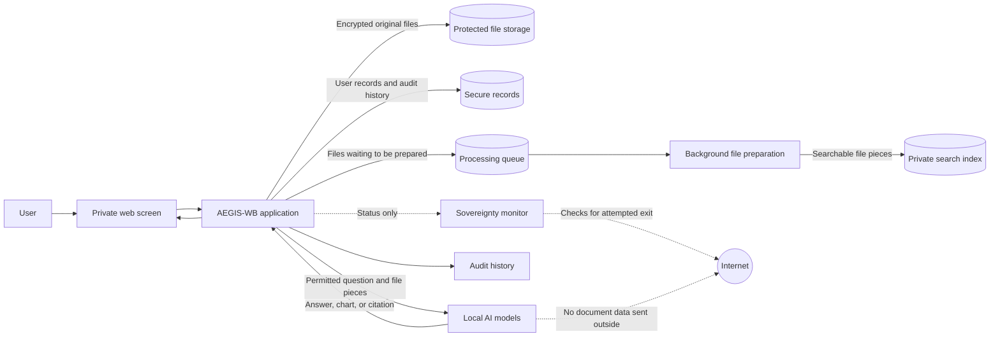
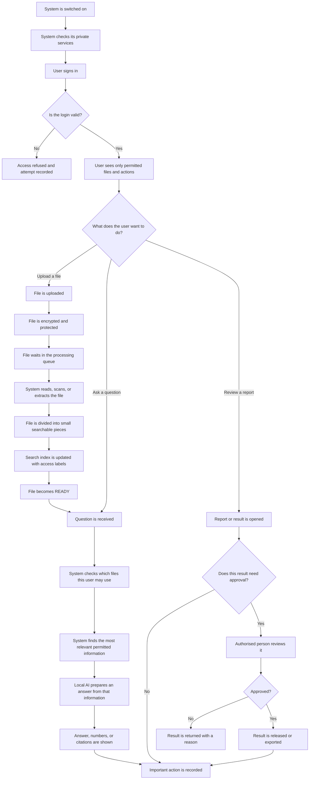
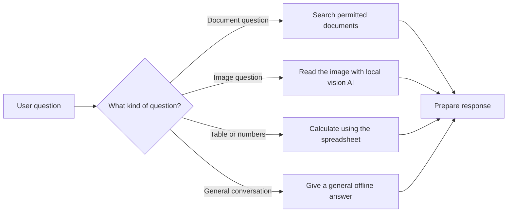
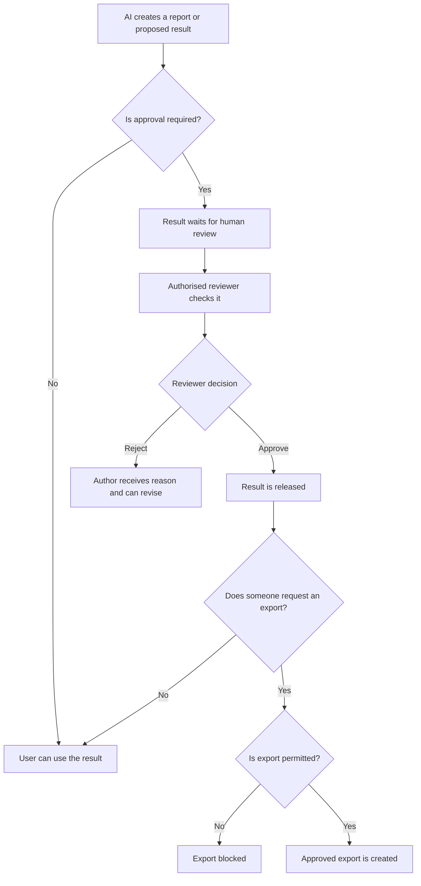

# AEGIS-WB: Simple Data Flow Guide

## What is AEGIS-WB?

AEGIS-WB is a private AI assistant for industrial teams. It helps people search
their manuals, reports, images, and spreadsheets without sending the information
to the internet.

The system works like a secure office:

- **The browser** is the reception desk where a user uploads files and asks questions.
- **The application** is the staff that checks identity, permissions, and requests.
- **The storage areas** keep original files, records, and search information.
- **The local AI models** read and understand information inside the workstation.
- **The audit log** is the register that records important actions.

## One important promise

All documents, questions, answers, and AI processing stay on the organisation's
own computer. The system is designed for work that must not be sent to a cloud AI
service.

## Where the data goes

This picture shows the main places through which information travels. The AI and
storage areas are inside the private workstation. The internet is monitored and
is not used to process the organisation's files.

## The complete journey

This is the normal journey from starting the system to receiving an answer:

## 1. Starting the system

When AEGIS-WB starts, it checks that its private services are available. It also
checks its settings and prepares the local AI models.

If an important check fails, the system does not quietly continue. It reports the
problem so that an operator can correct it.

## 2. Signing in

The user enters a username and password. After a successful sign-in, the system
gives the user a temporary access pass.

The user's role and clearance decide what they can see or do. For example, an
operator may read public safety instructions, while an auditor may read restricted
records and the audit history.

## 3. Uploading a document

The user can upload a PDF, Word file, text file, image, CSV, or Excel file.

The following happens:

1. The system checks that the file is an allowed size and type.
2. The original file is encrypted before it is saved.
3. The file is placed in a queue. This means the user does not need to wait while
   every page is prepared.
4. A background worker prepares the file.

The file normally moves through these stages:

`QUEUED` -> `PROCESSING` -> `READY`

If something goes wrong, it becomes `FAILED`. An authorised user can retry it.

## 4. Preparing a document for search

The preparation depends on the file:

- A PDF, Word, or text file is read as text.
- A scanned page or image is read using optical character recognition (OCR).
- A CSV or Excel file is read as a table so that rows, columns, totals, and charts
  can be understood.

The system then divides the content into small pieces. Each piece receives search
information and access labels such as department, clearance level, and owner.
This lets the system find useful information later without giving the AI the whole
file every time.

## 5. Asking a question

The user asks a normal question, such as:

> Why did Turbine-4 stop on 14 August?

AEGIS-WB decides what kind of help is needed:

### Document question

The system first checks the user's permissions. It searches only content that the
user is allowed to see. It then gives the best matching pieces to the local AI.
The answer includes source details, such as the document name and page number,
when a reliable source is found.

### Image question

The local vision model examines the image. For example, it may describe a visible
problem in a machine photograph and compare that observation with an approved
maintenance manual.

### Table or spreadsheet question

The system calculates totals, averages, trends, or groups directly from the data.
It can show charts and a structured insights report. This avoids asking the AI to
guess numbers from a long spreadsheet.

### No matching document

If no trustworthy permitted source is found, the system does not invent a fake
citation. It gives a clearly separate general offline answer instead.

## 6. Showing the answer

The answer can contain:

- A plain-language explanation.
- Numbers or charts for a table-based question.
- Links back to the source document and page.
- A note showing whether the answer is based on the user's documents.

The answer is sent gradually, so the user can begin reading while the rest is
being prepared.

## 7. Reports, approvals, and exports

Some results are only suggestions until an authorised person reviews them.

The AI cannot independently release a high-consequence result. The responsible
human remains part of the decision.

## 8. How privacy and safety are maintained

### Permission checks happen before search

The system filters the search itself. A document that the user is not allowed to
see is not passed to the AI for consideration.

### Files are encrypted

Stored originals are protected with encryption. If a stored file is changed or
damaged, its protection check can detect the problem.

### Important actions are recorded

The system records events such as sign-in, upload, document processing, questions,
approvals, exports, and denied actions. The records are linked together so that
an unexpected change can be detected.

### Internet access is monitored

The Sovereignty Sentinel checks whether anything tries to leave the workstation.
The local AI and data services are not exposed directly to the browser or the
internet.

## Simple example

1. A maintenance engineer uploads `Turbine-4-Manual.pdf`.
2. AEGIS-WB encrypts it and prepares its pages in the background.
3. The engineer asks, “What vibration level causes a protection trip?”
4. The system checks that the engineer can read the maintenance department files.
5. It finds the relevant page and asks the local AI to explain it.
6. The answer includes the page reference and is saved in the audit history.
7. If the engineer turns the analysis into an official deliverable, an authorised
   reviewer must approve it before release.

## Small glossary

| Term | Meaning in everyday language |
|---|---|
| **AI model** | The local software that reads information and writes an answer. |
| **Clearance** | The sensitivity level of information a person may access. |
| **OCR** | Reading words from a scanned page or photograph. |
| **Search index** | An organised map that helps find relevant parts of files quickly. |
| **Citation** | A reference showing where an answer came from. |
| **Audit log** | A history of important actions and decisions. |
| **Air-gapped** | Designed so data and processing stay inside the private workstation. |
| **Human-in-the-loop** | A person must review or approve a sensitive action. |

## In one sentence

AEGIS-WB securely receives a user's information, prepares it locally, finds only
the information that user is allowed to see, creates a traceable answer, and asks
an authorised human to approve sensitive results.
