# AEGIS-WB — Workflows & Security Flow Diagrams

This document explains how **every major part** of AEGIS works and — in its own
set of diagrams — **what keeps the whole system secure**. Every section has a
rendered image; the Mermaid source is folded below each one (`<details>`) so you
can re-render or edit it.

## Contents

- [0. The system at a glance](#0-the-system-at-a-glance)
- [1. Boot / startup sequence](#1-boot--startup-sequence)
- [2. Document upload & ingest pipeline](#2-document-upload--ingest-pipeline)
- [3. Chat turn (grounded chat, streaming)](#3-chat-turn)
- [4. Auto-analysis & tabular insights](#4-auto-analysis--tabular-insights)
- [5. Deliverable & approval flow](#5-deliverable--approval-flow)
- [6. What keeps everything secure](#6-what-keeps-everything-secure)
- [Appendix: threat map](#appendix-threat-map)

---

## 0. The system at a glance

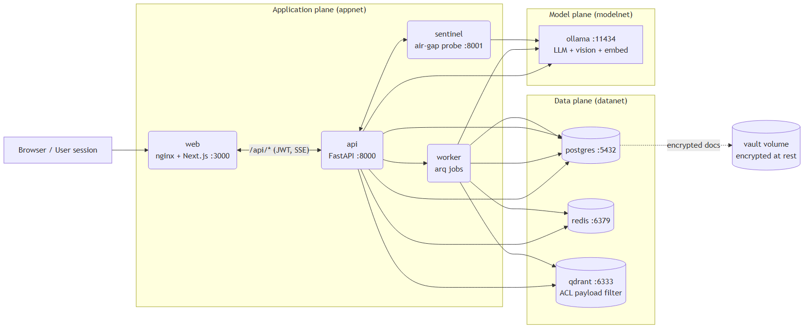

- **Three networks** isolate planes: `appnet`, `datanet`, `modelnet`. Model plane
  is never exposed to the browser.
- **One code path for data**: every component reaches data through the API/worker,
  never from the browser directly.

<details><summary>Mermaid source</summary>

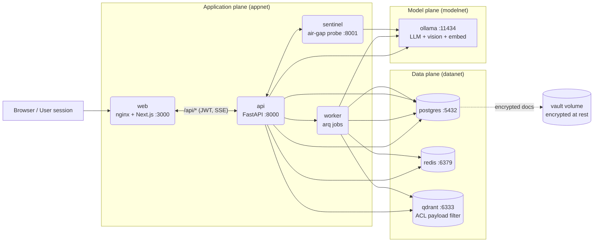
```mermaid
flowchart LR
    USER["Browser / User session"] --> WEB("web\nnginx + Next.js :3000")

    subgraph APP["Application plane (appnet)"]
        WEB <-- "/api/* (JWT, SSE)" --> API("api\nFastAPI :8000")
        API <--> SENT("sentinel\nair-gap probe :8001")
        API --> WORKER("worker\narq jobs")
    end

    subgraph DATA["Data plane (datanet)"]
        API & WORKER --> PG[("postgres :5432")]
        API & WORKER --> PG
        API & WORKER --> RD[("redis :6379")]
        API & WORKER --> QD[("qdrant :6333\nACL payload filter")]
    end

    subgraph MOD["Model plane (modelnet)"]
        API & WORKER & SENT --> OLLAMA["ollama :11434\nLLM + vision + embed"]
    end

    VAULT[("vault volume\nencrypted at rest")]
    PG -. encrypted docs .-> VAULT
```

</details>

---

## 1. Boot / startup sequence

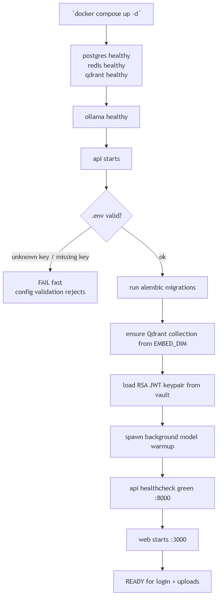

Notes:

- **Config is fail-fast**: extra or unknown `.env` keys are rejected at startup so
  a misconfigured deploy cannot silently run.
- **Model warm‑up** pre-loads `LLM_MODEL` + `VISION_MODEL` in the background so the
  first chat turn is not penalised by cold-start loading.
- Only the **model pull step** (`ollama pull`) ever needs internet — and it runs
  on the build machine, not at runtime.

<details><summary>Mermaid source</summary>

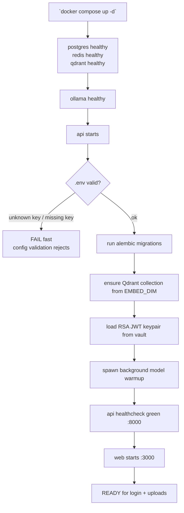
```mermaid
flowchart TD
    A[`docker compose up -d`] --> B[postgres healthy\nredis healthy\nqdrant healthy]
    B --> C[ollama healthy]
    C --> D[api starts]
    D --> D1{".env valid?"}
    D1 -- "unknown key / missing key" --> D2[FAIL fast\nconfig validation rejects]
    D1 -- "ok" --> D3[run alembic migrations]
    D3 --> D4[ensure Qdrant collection from EMBED_DIM]
    D4 --> D5[load RSA JWT keypair from vault]
    D5 --> D6[spawn background model warmup]
    D6 --> D7[api healthcheck green :8000]
    D7 --> E[web starts :3000]
    E --> F[READY for login + uploads]
```

</details>

---

## 2. Document upload & ingest pipeline

File lifecycle: `QUEUED → PROCESSING → READY` (re-enqueueable only from
`FAILED`/`READY`).

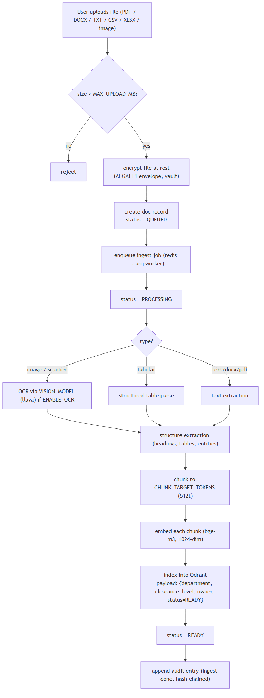

What happens on failure:

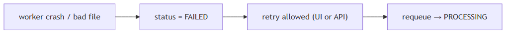

- Files are **encrypted before** any row is committed.
- The Qdrant point payload carries the document's `department` + `clearance_level`
  + `owner` so retrieval can be access-controlled *at the vector store* (see
  [§6.4](#64-rag-acl-filtering)).

<details><summary>Mermaid source</summary>

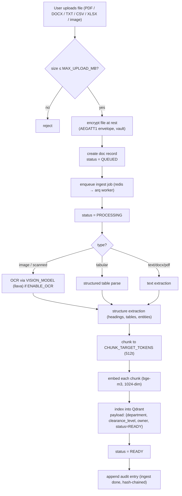
```mermaid
flowchart TD
    U["User uploads file (PDF / DOCX / TXT / CSV / XLSX / image)"] --> CHK{"size ≤ MAX_UPLOAD_MB?"}
    CHK -- "no" --> REJ["reject"]
    CHK -- "yes" --> ENC["encrypt file at rest\n(AEGATT1 envelope, vault)"]
    ENC --> R1["create doc record\nstatus = QUEUED"]
    R1 --> R2["enqueue ingest job (redis → arq worker)"]
    R2 --> R3["status = PROCESSING"]

    R3 --> T{"type?"}
    T -- "image / scanned" --> OCR["OCR via VISION_MODEL (llava) if ENABLE_OCR"]
    T -- "tabular" --> TAB["structured table parse"]
    T -- "text/docx/pdf" --> TXT["text extraction"]
    OCR & TAB & TXT --> STR["structure extraction (headings, tables, entities)"]
    STR --> CHUNK["chunk to CHUNK_TARGET_TOKENS (512t)"]
    CHUNK --> EMB["embed each chunk (bge-m3, 1024-dim)"]
    EMB --> IDX["index into Qdrant\npayload: {department, clearance_level, owner, status=READY}"]
    IDX --> OK["status = READY"]
    OK --> AUD1["append audit entry (ingest done, hash-chained)"]
```

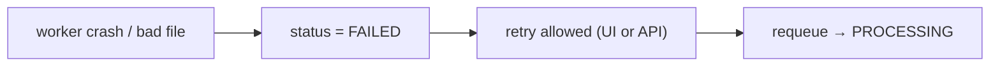
```mermaid
flowchart LR
    P["worker crash / bad file"] --> F["status = FAILED"]
    F --> RET["retry allowed (UI or API)"]
    RET --> R["requeue → PROCESSING"]
```

</details>

---

## 3. Chat turn

Frontend wiring: `POST /sessions` (auto-titled), `POST messages` returns a
`turn_id`, then the browser connects to the SSE stream
`/api/v1/chat/sessions/{id}/stream?turn_id=…`.

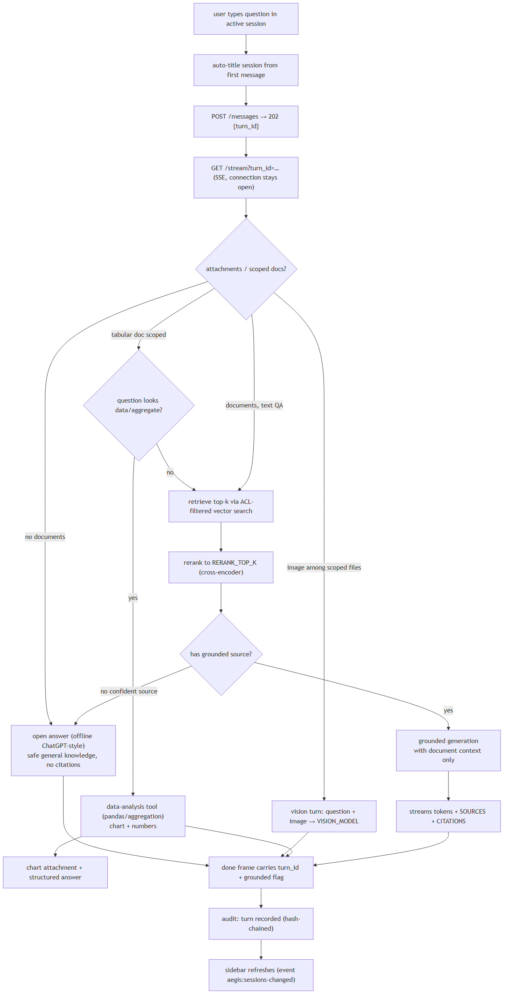

New-chat behaviour (fixed): the assistant bubble is created *before* the stream
starts; navigation/history reload never clears it while `isStreaming`, and the
stream self-heals if the last message is not an assistant message.

<details><summary>Mermaid source</summary>

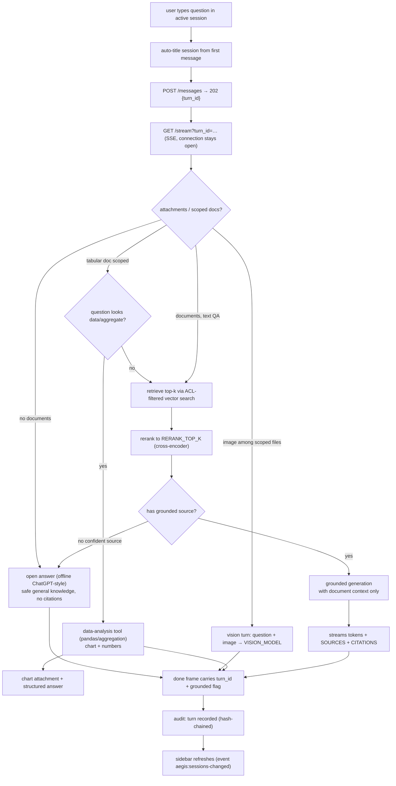
```mermaid
flowchart TD
    P["user types question in active session"] --> T["auto-title session from first message"]
    T --> TX["POST /messages → 202 {turn_id}"]
    TX --> SSE["GET /stream?turn_id=… (SSE, connection stays open)"]
    SSE --> A1{"attachments / scoped docs?"}

    A1 -- "no documents" --> OPEN["open answer (offline ChatGPT-style)\nsafe general knowledge, no citations"]
    A1 -- "image among scoped files" --> VIS["vision turn: question + image → VISION_MODEL"]
    A1 -- "tabular doc scoped" --> DATA{"question looks data/aggregate?"}
    DATA -- "yes" --> DE["data-analysis tool (pandas/aggregation)\nchart + numbers"]
    DE --> INS["chart attachment + structured answer"]
    DATA -- "no" --> RAG

    OPEN & VIS & DE --> FIN

    A1 -- "documents, text QA" --> RAG["retrieve top-k via ACL-filtered vector search"]
    RAG --> RR["rerank to RERANK_TOP_K (cross-encoder)"]
    RR --> G{"has grounded source?"}
    G -- "yes" --> GC["grounded generation\nwith document context only"]
    GC --> CIT["streams tokens + SOURCES + CITATIONS"]
    G -- "no confident source" --> OPEN
    CIT --> FIN

    FIN["done frame carries turn_id + grounded flag"]
    FIN --> AUD["audit: turn recorded (hash-chained)"]
    AUD --> SB["sidebar refreshes (event aegis:sessions-changed)"]
```

</details>

---

## 4. Auto-analysis & tabular insights

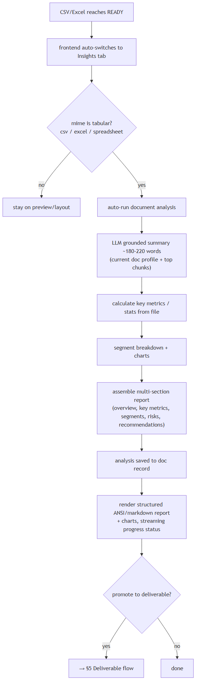

Perceived speed notes from tuning:

- Summary target tightened and `max_tokens` cut (1k→512) → a 1000-row CSV analysis
  went from ~163 s to ~59 s.
- Only the first 80 profile lines feed the summary; the rest is handled
  computationally (charts/stats) — not by the LLM.

<details><summary>Mermaid source</summary>

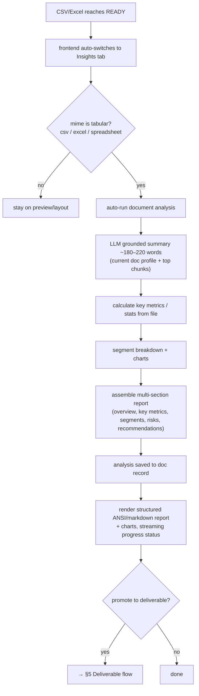
```mermaid
flowchart TD
    UP["CSV/Excel reaches READY"] --> AU["frontend auto-switches to Insights tab"]
    AU --> CHK{"mime is tabular?\ncsv / excel / spreadsheet"}
    CHK -- "no" --> OTH["stay on preview/layout"]
    CHK -- "yes" --> AC["auto-run document analysis"]
    AC --> SUMM["LLM grounded summary ~180–220 words\n(current doc profile + top chunks)"]
    SUMM --> MET["calculate key metrics / stats from file"]
    MET --> SEG["segment breakdown + charts"]
    SEG --> REP["assemble multi-section report\n(overview, key metrics, segments, risks, recommendations)"]
    REP --> STORE["analysis saved to doc record"]
    STORE --> UI["render structured ANSI/markdown report\n+ charts, streaming progress status"]
    UI --> APPR{"promote to deliverable?"}
    APPR -- "yes" --> DEL["→ §5 Deliverable flow"]
    APPR -- "no" --> DONE["done"]
```

</details>

---

## 5. Deliverable & approval flow

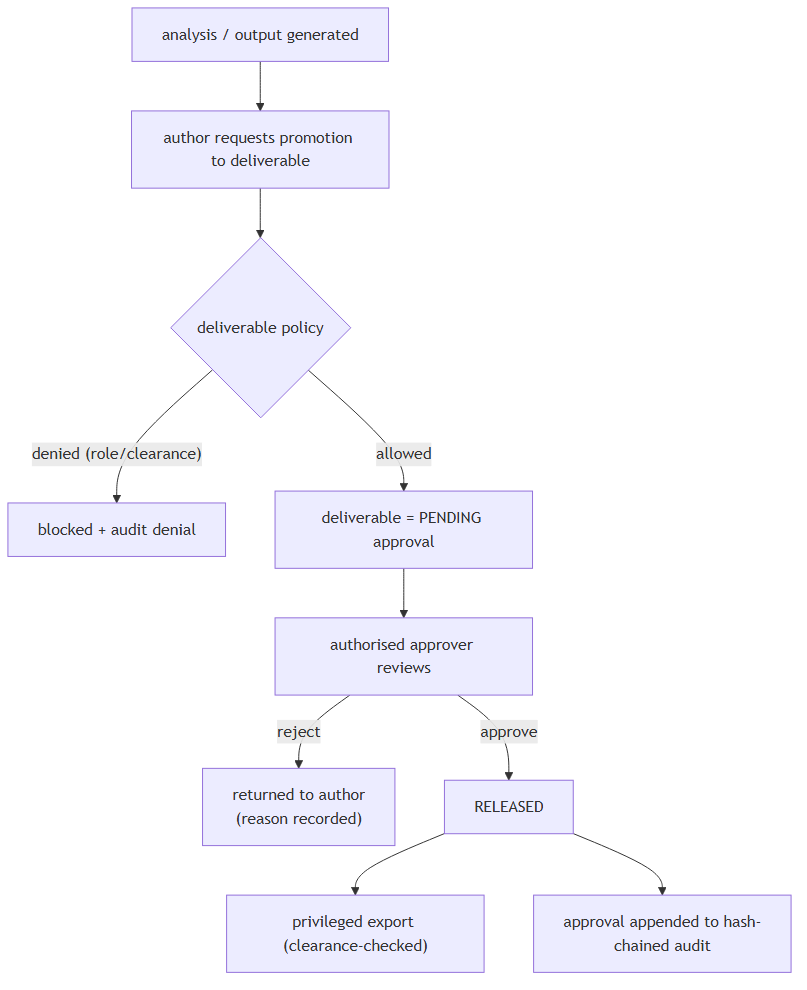

Every state change (create, reject, approve, export) is an audit event — there is
no silent path.

<details><summary>Mermaid source</summary>

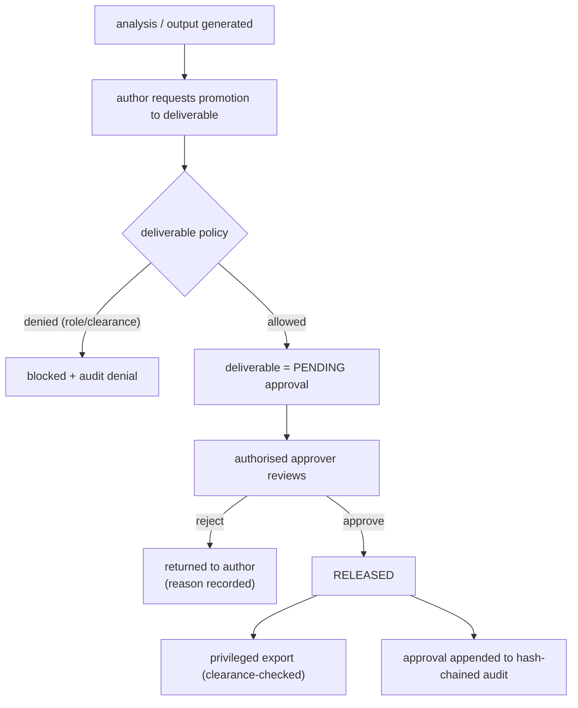
```mermaid
flowchart TD
    GEN["analysis / output generated"] --> PROM["author requests promotion to deliverable"]
    PROM --> POL{"deliverable policy"}
    POL -- "denied (role/clearance)" --> DENY["blocked + audit denial"]
    POL -- "allowed" --> PEND["deliverable = PENDING approval"]
    PEND --> APPR["authorised approver reviews"]
    APPR -- "reject" --> REJ["returned to author\n(reason recorded)"]
    APPR -- "approve" --> REL["RELEASED"]
    REL --> EXPORT["privileged export (clearance-checked)"]
    REL --> AUD2["approval appended to hash-chained audit"]
```

</details>

---

## 6. What keeps everything secure

### 6.1 Authentication

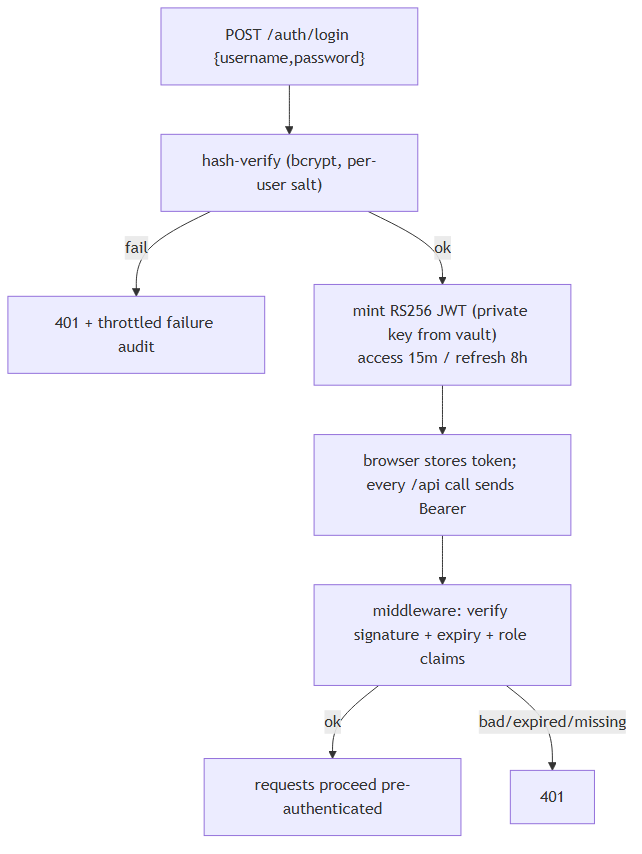

### 6.2 Authorization (RBAC + clearance)

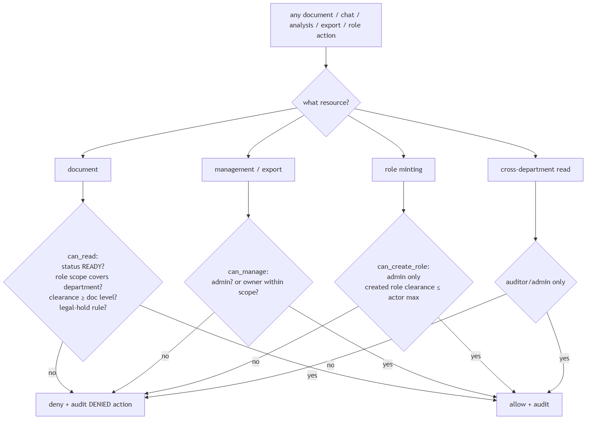

### 6.3 Encryption at rest (files)

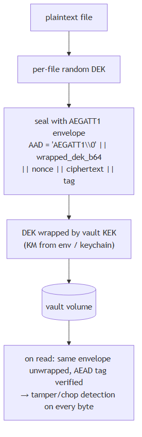

### 6.4 RAG ACL filtering

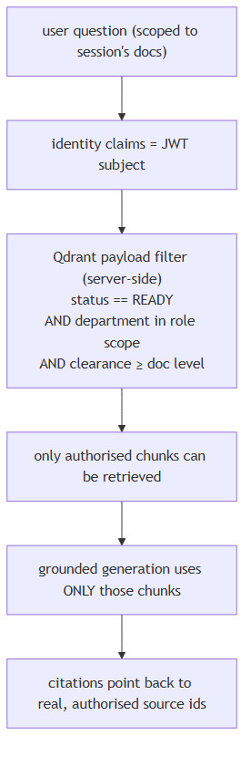

The ACL is enforced **inside the vector query**, not by post-filtering results —
unauthorised content never even reaches the LLM context.

### 6.5 Audit trail (hash-chained)

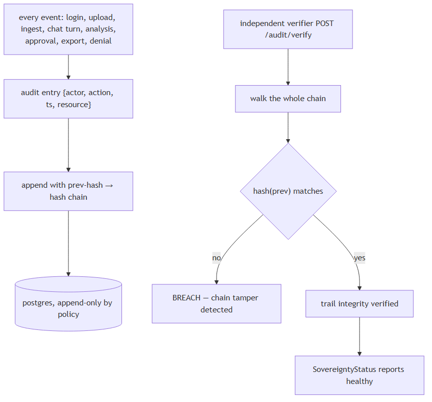

### 6.6 Sovereignty / air-gap

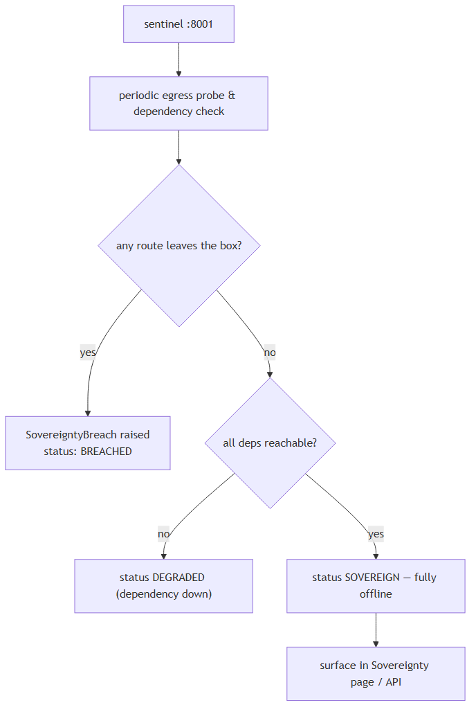

<details><summary>Mermaid source (security diagrams 6.1–6.6)</summary>

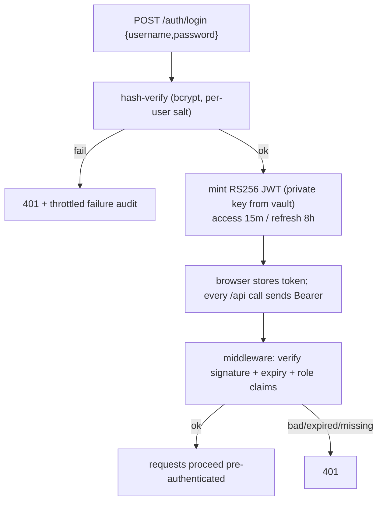
```mermaid
flowchart TD
    L["POST /auth/login {username,password}"] --> HV["hash-verify (bcrypt, per-user salt)"]
    HV -- "fail" --> R1["401 + throttled failure audit"]
    HV -- "ok" --> JWT["mint RS256 JWT (private key from vault)\naccess 15m / refresh 8h"]
    JWT --> CLI["browser stores token; every /api call sends Bearer"]
    CLI --> M["middleware: verify signature + expiry + role claims"]
    M -- "ok" --> INSIDE["requests proceed pre-authenticated"]
    M -- "bad/expired/missing" --> R2["401"]
```

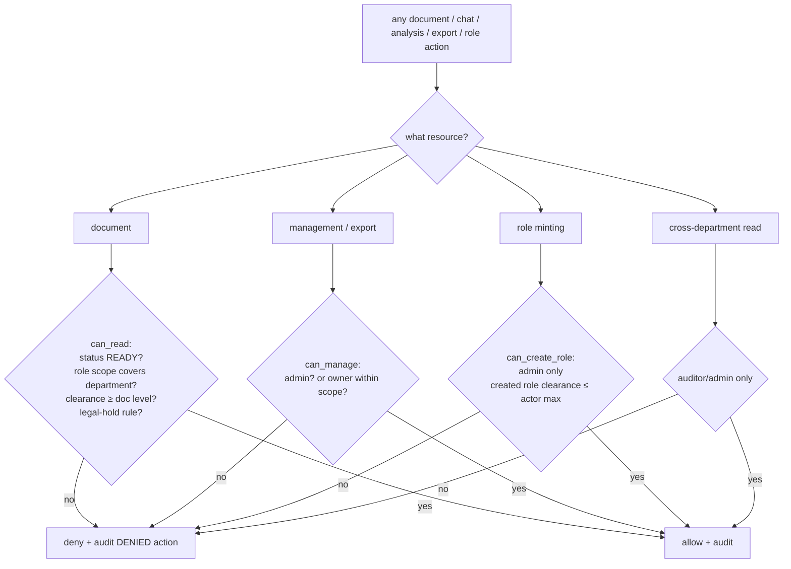
```mermaid
flowchart TD
    REQ["any document / chat / analysis / export / role action"] --> R{"what resource?"}
    R --> RN["document"] --> RD{"can_read:\nstatus READY?\nrole scope covers department?\nclearance ≥ doc level?\nlegal-hold rule?"}
    R --> RA["management / export"] --> RAD{"can_manage:\nadmin? or owner within scope?"}
    R --> RU["role minting"] --> RUD{"can_create_role:\nadmin only\ncreated role clearance ≤ actor max"}
    R --> RC["cross-department read"] --> RCD{"auditor/admin only"}
    RD & RAD & RUD & RCD -- "no" --> DEN["deny + audit DENIED action"]
    RD & RAD & RUD & RCD -- "yes" --> ALLOW["allow + audit"]
```

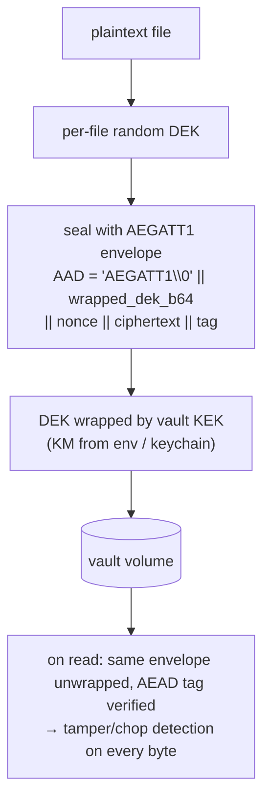
```mermaid
flowchart TD
    FILE["plaintext file"] --> DEK["per-file random DEK"]
    DEK --> SEAL["seal with AEGATT1 envelope\nAAD = 'AEGATT1\\0' || wrapped_dek_b64\n|| nonce || ciphertext || tag"]
    SEAL --> KEK["DEK wrapped by vault KEK\n(KM from env / keychain)"]
    KEK --> VAULT[("vault volume")]
    VAULT --> READ["on read: same envelope unwrapped, AEAD tag verified\n→ tamper/chop detection on every byte"]
```

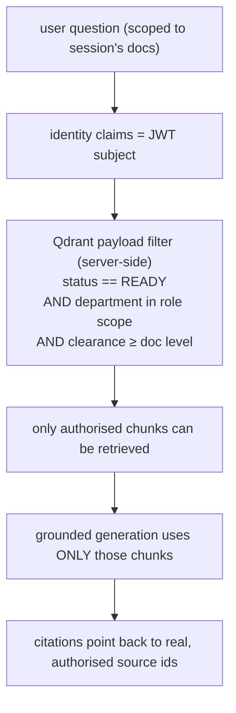
```mermaid
flowchart TD
    Q["user question (scoped to session's docs)"] --> ID["identity claims = JWT subject"]
    ID --> FILTER["Qdrant payload filter (server-side)\nstatus == READY\nAND department in role scope\nAND clearance ≥ doc level"]
    FILTER --> HITS["only authorised chunks can be retrieved"]
    HITS --> GR["grounded generation uses ONLY those chunks"]
    GR --> CITE["citations point back to real, authorised source ids"]
```

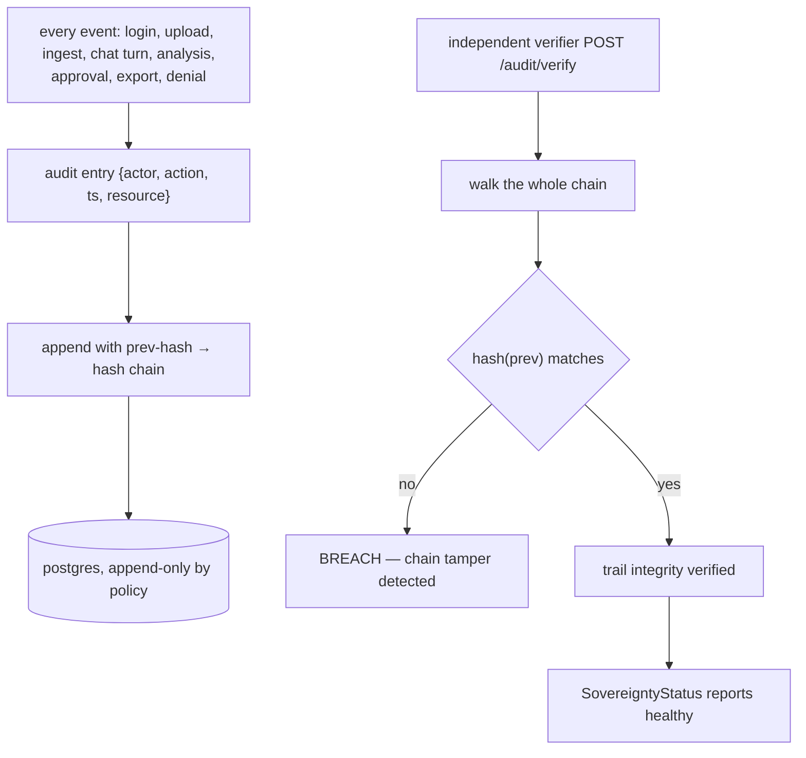
```mermaid
flowchart TD
    EV["every event: login, upload, ingest, chat turn, analysis,\napproval, export, denial"] --> ENTRY["audit entry {actor, action, ts, resource}"]
    ENTRY --> CHAIN["append with prev-hash → hash chain"]
    CHAIN --> DB[("postgres, append-only by policy")]
    VER["independent verifier POST /audit/verify"] --> WALK["walk the whole chain"]
    WALK --> T{"hash(prev) matches"}
    T -- "no" --> BR["BREACH — chain tamper detected"]
    T -- "yes" --> OK["trail integrity verified"]
    OK --> SOV["SovereigntyStatus reports healthy"]
```

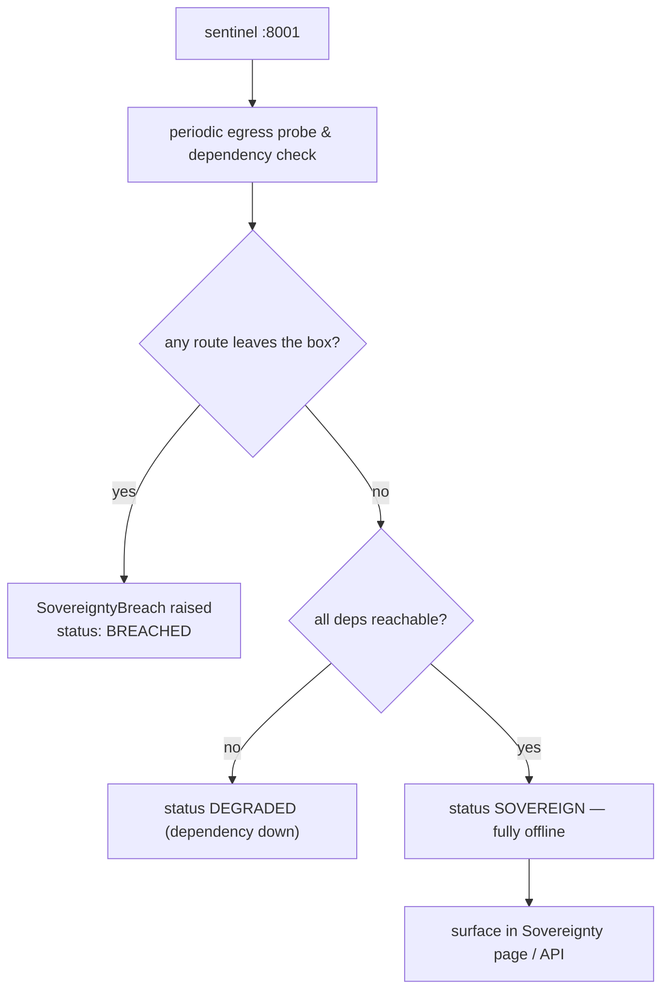
```mermaid
flowchart TD
    SENT["sentinel :8001"] --> PROBE["periodic egress probe & dependency check"]
    PROBE --> R1{"any route leaves the box?"}
    R1 -- "yes" --> ALERT["SovereigntyBreach raised\nstatus: BREACHED"]
    R1 -- "no" --> R2{"all deps reachable?"}
    R2 -- "no" --> DEG["status DEGRADED (dependency down)"]
    R2 -- "yes" --> H["status SOVEREIGN — fully offline"]
    H --> UI["surface in Sovereignty page / API"]
```

</details>

---

## Appendix: threat map

| What is threatened | How AEGIS defends it | Where (diagram) |
|---|---|---|
| Stolen/expired tokens | Short TTL 15m + RS256 verify + refresh rotation | [§6.1](#61-authentication) |
| Lateral / unauthorised read | RBAC + clearance + dept scope + legal-hold | [§6.2](#62-authorization-rbac--clearance) |
| Disk theft of vault volume | AEAD AEGATT1 envelope, tamper tag per file | [§6.3](#63-encryption-at-rest-files) |
| Prompt-injection causing leakage | RAG ACL filter before LLM context; grounded-only generation | [§6.4](#64-rag-acl-filtering) |
| Audit tampering / insider edit | Hash-chain + independent verify endpoint | [§6.5](#65-audit-trail-hash-chained) |
| Accidental egress / exfiltration | Sentinel probe + `AIRGAP_MODE`; modelnet isolated | [§6.6](#66-sovereignty--air-gap) |
| Misconfiguration | Fail-fast `.env` validation + fail-fast healthchecks | [§1](#1-boot--startup-sequence) |
| Queue/replay abuse | `turn_id`-scoped streams; denial + failure audited | [§3](#3-chat-turn) / [§5](#5-deliverable--approval-flow) |

---

## Re-render instructions

```powershell
# Edit any <details> mermaid source → save as diagram.mmd → render:
$env:PUPPETEER_SKIP_DOWNLOAD="true"
npx -y @mermaid-js/mermaid-cli -i diagram.mmd -o diagrams/out.png -b white -w 2400
# (uses the system Edge as the renderer)
```

---

*Generated for SIH26117 — Smart India Hackathon 2026. Run `make smoke` to confirm
all services, then open `http://localhost:8001/sentinel/status` to watch the
sovereignty light stay green.*